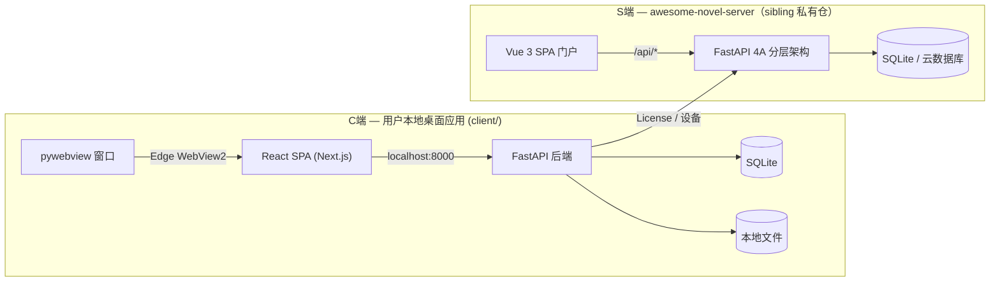

# CLAUDE.md

本文件为 Claude Code (claude.ai/code) 处理本代码库时提供指导。

## 项目

爱小说（Awesome Novel）—— 基于 C/S 架构的 AI 辅助长篇小说创作平台。单用户桌面应用，用户在本地创建和管理小说项目，按照六阶段工作流（init → settings → outline → prompt → write → archive）与 AI 协作创作，按 Token 用量计费。

## 时区口径（2026-09-01 拍板）

- **存储与后端计算永远是 naive UTC**：取当前时刻用 `datetime.now(UTC).replace(tzinfo=None)`，取当前日期用 `datetime.now(UTC).date()`；禁止裸 `datetime.now()` / `date.today()`（隐式依赖容器时区，实测切换 TZ 即偏 8 小时）。
- **上海时区只发生在前端展示**：S端 前端 `pay.ts` 的 `fmtBj` 是唯一转换点（无 offset 字符串按 UTC 解析 → `Asia/Shanghai` 格式化），后端不出上海时间字符串（拆仓后该文件在 awesome-novel-server 仓）。
- **容器 TZ / PG 数据库时区 / PostgREST 连接时区不作为口径依据**：不得通过改环境配置"统一时区"；orders 等表的 `created_at` 由应用显式传 UTC 值，不依赖 DB DEFAULT `now()`。
- TZ 抗性测试：S端 仓 `server/tests/test_timezone_discipline.py`（进程切 Asia/Shanghai 断言会员剩余/注册写入不偏移）。

## 工作原则

减少常见 LLM 编码错误的行为准则。按需与项目特定指令合并使用。

权衡：这些准则倾向于谨慎而非速度。对于简单任务，请自行判断。

### 1. 编码前先思考
不要假设。不要隐藏困惑。显化权衡。

在实现之前：
- 明确陈述你的假设。如果不确定，请提问。
- 如果存在多种解读，请全部呈现——不要默默选择。
- 如果存在更简单的方案，请说出来。必要时坚持己见。
- 如果有不清楚的地方，停下来。指出哪里令人困惑。提问。

### 2. 简洁优先
用最少的代码解决问题。不做任何推测性的设计。

- 不添加超出需求的功能。
- 不为只用一次的代码做抽象。
- 不引入未被要求的"灵活性"或"可配置性"。
- 不处理不可能发生的场景的错误。
- 如果你写了 200 行但 50 行就能搞定，重写它。
- 问自己："资深工程师会说这过度设计了吗？"如果答案是肯定的，简化它。

### 3. 精准修改
只碰你必须碰的。只清理你自己留下的混乱。

编辑现有代码时：
- 不要"改进"相邻的代码、注释或格式。
- 不要重构没坏的东西。
- 匹配现有风格，即使你自己不会那样写。
- 如果你注意到无关的废弃代码，提出来——不要删除它。

当你的变更产生孤儿代码时：
- 删除你的变更导致不再使用的 import/变量/函数。
- 不要删除既有的废弃代码，除非被要求。
- 检验标准：每一行变更都应能直接追溯到用户的请求。

### 4. 目标驱动执行
定义成功标准。循环验证直到通过。

将任务转化为可验证的目标：
- "添加校验" → "为无效输入编写测试，然后让它们通过"
- "修复 Bug" → "编写一个能复现它的测试，然后让它通过"
- "重构 X" → "确保重构前后测试都通过"

对于多步骤任务，简要列出计划：
1. [步骤] → 验证：[检查点]
2. [步骤] → 验证：[检查点]
3. [步骤] → 验证：[检查点]

强有力的成功标准让你能独立循环。弱标准（"让它跑起来"）需要不断澄清。

这些准则有效的情况是：diff 中不必要的变更更少、因过度设计导致的重写更少、澄清问题出现在实现之前而非犯错之后。

## C端前端设计语言（写 client/ 前端前必读）

在 ai-novel 项目里写前端时，动手前按顺序读完：

1. `docs/ux/design-language.html` —— 标准层，token/词汇以它为准
2. `docs/design-c/prototypes/CLAUDE.md` —— 原型层规范 + §7 避坑
3. `docs/design-c/prototypes/*.html` —— 像素基线，对照实现

硬规则：

- 只写 `client/` 代码，不改 `docs/` 下的规范与原型。
- 发现设计有问题：先在 `docs/design-c/prototypes/ADJUSTMENTS.md` 登记，再动手。
- 禁止两套类名并存。
- 颜色一律用规范里的 oklch token，禁止裸 hex/rgb/hsl。
- 图标用内联 SVG 单线。

## 常用命令

> **拆仓注记（s-server-repo-split，2026-10）**：S端 已迁私有仓
> `awesome-novel-server`（支付/鉴权/设备/套餐/发码/营销）。本仓＝C端。两仓 sibling
> checkout 约定：同级放置，compose 以 `${S_SERVER_DIR:-../awesome-novel-server/server}`
> 取服务端源码；S端 开发/测试/部署入口见该仓 CLAUDE.md。

> **提示词源注记（c-prompt-source-flip，2026-10）**：产品提示词模板已迁私有仓
> `awesome-novel-prompts`（`prompts/*.prompt`＝唯一编辑源，文件带纳管注释；
> 发布链 publish.py/release.yml 也在该仓）。本仓**不跟踪任何 .prompt**。开发/测试态
> 经 sibling checkout 取模板：同级放置，compose 只读挂载
> `${PROMPTS_DIR:-../awesome-novel-prompts/prompts}` 并注入 `PROMPT_PACK_DEV_DIR`；
> 原生直跑（dev-up.sh --native）自动注入同款。检出不在位时 AI 功能按「写作能力未就绪」
> 提示（503 prompts_missing），不阻断起栈。改提示词＝在该仓改 → 提交推送 → 发布走
> 该仓 Actions「发布提示词包」；内容闸门（分层/占位符对拍）在该仓 CI。

```bash
# ═══ C端 ═══

# 终端 1：S端 后端（本地模拟——来自 sibling 仓）
cd ../awesome-novel-server/server && python app/main.py

# 终端 2：C端 后端
cd client/backend && mkdir -p data
DATA_ROOT=./data SERVER_API_BASE=http://127.0.0.1:19000/api \
  uvicorn main:app --reload --host 127.0.0.1 --port 8000

# 终端 3：C端 前端（Next.js 开发服务器）
cd client/frontend && npm run dev

# C端 前端类型检查 / 构建
cd client/frontend && npx tsc --noEmit && npm run build

# C端 后端测试
cd client/backend && python -m pytest tests/ -v

# C端 E2E 测试（需要 Docker 四服务栈运行；S端 源码走 sibling checkout）
cd client/frontend && npx playwright test

# e2e/跑批在非 sibling 布局（如 /tmp worktree）起栈：compose 的提示词挂载默认
# ../awesome-novel-prompts/prompts 解析不到（Docker 造空目录→AI 按 503 语义），
# 须显式传 PROMPTS_DIR 指向提示词仓检出：
#   PROMPTS_DIR=/path/to/awesome-novel-prompts/prompts docker compose -p <proj> ...
```

## 架构



C端 是单用户桌面应用（FastAPI + SQLite + React SPA，pywebview 封装），提供 AI 写作全流程。
S端（License 授权/支付/设备/套餐）已拆至私有仓 `awesome-novel-server`，本仓只经 HTTP API 与之协作。SSE 用于 C端 流式生成正文。

## 目录结构

```
ai-novel/
├── client/                    # C端 — 用户本地桌面应用
│   ├── backend/              FastAPI 后端
│   │   ├── main.py           FastAPI 应用，lifespan（自动建表 + 启动迁移），路由注册
│   │   ├── config.py         本地配置 (DATA_ROOT, JWT_SECRET, SERVER_API_BASE)
│   │   ├── db.py             SQLAlchemy + SQLite
│   │   ├── ai_client.py      动态 API Key 的 AI 客户端
│   │   ├── api_configs/      API Key 多配置管理（厂商检测/连接测试/CRUD/用量统计）
│   │   ├── models/           SQLAlchemy ORM: User, Project, TokenLog, NovelFile, ProjectSetting, Genre
│   │   ├── auth_local/       License 验证模块（S端通信 + 离线缓存）
│   │   ├── projects/         项目 CRUD
│   │   ├── settings/         设定管理 + AI 生成 + 渲染（render.py）
│   │   ├── genres/           全局题材库（CRUD/种子/写作链路注入）
│   │   ├── chapters/         卷章 CRUD
│   │   ├── workflow/         阶段机 + gate 验证
│   │   ├── prompt/           提示词组装
│   │   ├── write/            SSE 流式写作
│   │   ├── archive/          归档
│   │   ├── filesystem/       存储后端（Local/Database/Composite 组合路由 + 启动迁移）
│   │   └── story/            剧情推演
│   ├── frontend/             React 19 SPA (Vite + daisyUI)
│   └── packaging/            PyInstaller + pywebview 打包
├── brand/                     # 品牌资产（双仓副本：S端 仓各持一份，改动两端同批）
├── docs/                     文档（specs + plans）
└── reference/                项目模板（YAML/MD templates）

# S端（支付/鉴权/设备/套餐/发码/营销）→ ../awesome-novel-server
```

## 关键设计决策

- **阶段门控机（Phase gate machine）**：每个工作流流转（`init→settings`、`settings→outline` 等）都有验证门。门控失败 → 流转被拒绝，API 返回缺少的内容。
- **六阶段工作流**：init → settings → outline → prompt → write → archive。write→outline 是唯一的反向流转（开始下一章）。
- **双存储后端**：小说内容可通过 `STORAGE_BACKEND` 环境变量存储在本地文件系统或数据库中。通过 `filesystem/storage.py` 中的 `StorageBackend` 协议抽象。
- **设定存数据库（组合路由后端）**：项目设定（story/world/style/anti-ai/hooks/genre/ai-model/status + characters）经 `filesystem/composite_storage.py` 的 `PATH_TO_KEY` 路由到 `project_settings` KV 表（ADR-001/002），其余路径路由 LocalFileBackend。**每路径唯一属主非镜像**。写作链路只经 `get_storage()` 协议读写，调用方零感知切换。章节/卷/正文/提示词/归档仍走文件。
- **设定渲染收敛 settings/render.py**：文风/反AI → 提示词字符串统一经 render.py（flatten_principles / fmt_mistakes / depiction_techniques_str / build_tone_section），容忍模板盘文件与前端/AI 保存的 dict/list 双态。前端两表单 merge-on-save（`{...existing, ...edited}`），因后端 PUT = 整体替换。
- **题材/文风分离**：叙事者角色与叙事基调归文风表单（writing-style `narrator_role` + `tone{default_tone, atmosphere, pov, techniques}`），题材库的 toneBlueprint/narratorRole 数据保留但不注入提示词。存量项目经启动回填 `backfill_tone_overrides` 一次性迁入文风 tone。
- **SSE 流式传输**：第五阶段写作期间每个段落一个 SSE 连接。前端可打开多个并行流，支持每个段落的暂停/停止。
- **S端 数据库双实现**（详见 awesome-novel-server 仓）：`DB_BACKEND` 决定仓储实现——`sqlite`（SQLAlchemy/SQLite，本地与测试默认）或 `pg_http`（CloudBase PostgreSQL PostgREST HTTP API + 环境 API Key，生产）。仓储接口在 `app/infrastructure/repositories/base.py`（5 个 Protocol），服务层只依赖接口，切换数据库只改环境变量。体验版套餐 PG 无 TCP 直连（无连接地址/账号管理），HTTP API 是唯一路径（service_role 绕过 RLS）；建表由 MCP `applyMigration` 预建并打标 alembic_version，`pg_http` 后端启动跳过迁移。
- **Token 计费**：每次 AI 调用记录到 `token_log` 并从用户余额中扣除。按模型计价（haiku：输入/输出每百万 $0.80/$4.00；sonnet：$3/$15）。
- **多租户隔离**：文件系统路径 `/data/{user_id}/`，数据库查询通过 JWT 中的 user_id 限定范围，v1 不支持项目共享。

## 关键约定

- **设定存 DB、正文存文件**：本地后端 9 类设定（含字符目录）经组合路由后端存 `project_settings` 表；章节/卷/提示词/归档/threads/md 存 `/data/projects/{user_id}/{project_slug}/` 下文件。SQLite 存储用户、项目、题材库与设定 KV。
- **流转前必须通过阶段门控**：`backend/workflow/gates.py` 中的函数验证前置条件。门控失败 → 返回 400 及缺失项列表。
- **项目所有权**：所有 API 端点从 JWT 提取 user_id，在任何文件或数据库操作前交叉校验 `project.user_id`。
- **模板文件**：`reference/` 存放 `.template` 文件。`backend/filesystem/init.py` 在创建新项目骨架时复制它们。
- **Token 计费**：每次 AI 调用创建 TokenLog 记录，相应扣除用户余额。`billing/service.py` 包含各模型费率。
- **文件系统访问**：始终使用 `filesystem/storage.py` 中的 `get_storage()`，而非直接文件 I/O，以支持两种存储后端。
- **非代码不 git 跟踪**：git 只跟踪代码与必要文档。本地工具产物（`.reasonix/`、`reasonix.toml`）、调试截图（`live-*.png` 等）、测试报告（`playwright-report/`）、本地配置（`.claude/settings.json`）一律不入库——新增此类文件时加入 `.gitignore`，而不是提交。

## 当前状态

### C端 — AI 写作桌面应用
- **后端**：FastAPI 全功能就绪（所有路由模块已接入，双存储后端，Token 计费，API Key 多配置管理）
- **前端**：React SPA 完整构建（写作工作室 SSE 流式、归档阅读器、时间线、设定表单）
- **测试**：后端 66 个测试通过，E2E 测试覆盖核心流程

### S端 — License 授权与设备管理服务
- **后端**：4A 分层架构重构完成（Domain / Application / Infrastructure / Interfaces 四层，11 个 use case，Alembic 迁移）
- **前端**：Vue 3 SPA 完整实现（8 页面 / 16 组件 / Pinia / 双主题 / 双向路由守卫 / 82 个 E2E 测试）
- **CI**：C端 前后端构建＋C端 打包 exe＋镜像构建（S端 前后端构建/部署已随拆仓迁 awesome-novel-server 仓）
