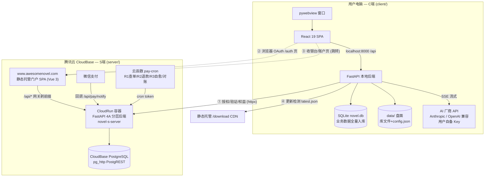
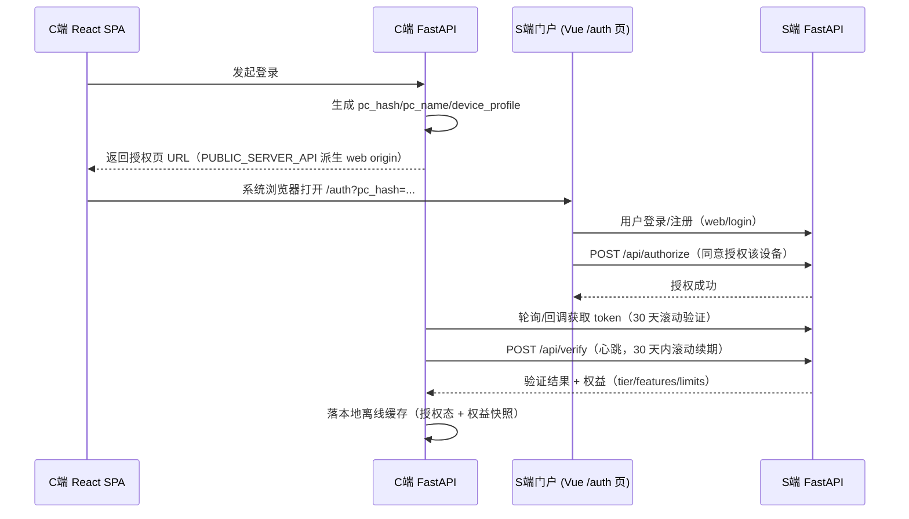
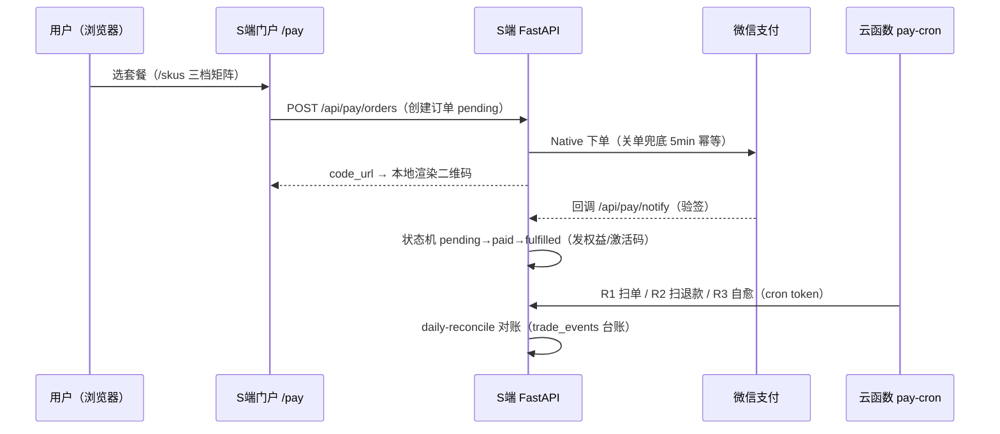

# 系统架构：C端 × S端 协同（第 1 层）

> 层次 1/3。本文描述两端作为一个整体的系统架构：部署拓扑、双端契约、协同链路与失败降级。
> 单端内部结构见 [02-c-client-architecture.md](02-c-client-architecture.md) 与 [03-s-server-architecture.md](03-s-server-architecture.md)。
> 事实来源是代码与 CI 配置；本文为 2026-09-11 快照。

## 1. 系统定位

AI Novel（爱小说）是 C/S 架构的 AI 辅助长篇小说创作平台：

- **C端（`client/`）**：单用户本地桌面应用。小说资产（正文/设定/版本/归档）全部落在用户本机，AI 调用由用户自备 API Key 直连厂商。**数据主权在用户本地。**
- **S端（`server/`）**：商业服务。承担账号、设备授权、权益（entitlement）、支付与对账，部署在腾讯云 CloudBase。**钱和权益的账本在云端。**

两端的关系是"**薄契约、重本地**"：C端只在授权/权益/更新检测三件事上依赖 S端，写作主流程完全离线可用（见 §6 失败降级）。

## 2. 总体视图

要点：

1. **AI 流量不经过 S端**。C端后端 `ai_client.py` 直接调厂商 API，Key 由用户在 C端 UI 配置（Fernet 加密落盘），S端对 AI 用量零感知。
2. **支付链路完全在 S端侧**。收银台是 S端门户的 Vue 页面（/pay），微信 Native 下单→扫码→回调→订单状态机→发码/激活，全链在云端闭环；C端只消费激活结果（授权码激活）或登录后看到的权益。
3. **S端门户是双角色的**：既是 C端用户登录/授权/查单的 C 页面（/auth、/pay、/support），又承载简单运营端点（出码/查码，ADMIN_TOKEN 保护）。

## 3. 部署拓扑

### 3.1 生产（云端）

| 组件 | 载体 | 说明 |
|------|------|------|
| S端门户 | CloudBase 静态托管（webapps 产品，`novel-s-web` 版本化部署） | Vue 3 SPA，`www.awesomenovel.com` 唯一入口；备案条/站点配置走运行时 `site-config.json` |
| S端后端 | CloudBase 云托管容器（`novel-s-server`，0.25C/0.5G，缩零） | FastAPI，容器镜像云端构建；`DB_BACKEND=pg_http` |
| 数据库 | CloudBase PostgreSQL（PostgREST HTTP API） | 体验版无 TCP 直连，HTTP + API Key（service_role 语义）是唯一路径 |
| 定时任务 | 云函数 `pay-cron`（R1 查单 / R2 退款 / R3 自愈）+ 后端 `/api/cron/daily-reconcile` | 经 CRON_TOKEN 鉴权打后端 cron 端点 |
| 安装包 | GitHub Releases（exe + dmg）+ latest.json 转存国内 CDN | 打 `v*` tag 一条龙自动出包 |

域名路由契约：`www.awesomenovel.com/api/*` 由网关**剥掉 `/api` 前缀**转发到 CloudRun；后端有前缀归一化中间件兜底（两种形态都能正确路由）。静态资源走同域 + `/download` 直达 CDN。

### 3.2 本地开发（docker-compose 四服务）

`docker-compose.yml` 提供一键全栈，也是 C端 e2e 的运行底座：

| 服务 | 容器端口 | 宿主端口（默认） |
|------|---------|----------------|
| server-backend | 19000 | 19000 |
| server-frontend（nginx） | 80 | 5173 |
| client-backend | 8000 | 8000 |
| client-frontend（nginx） | 80 | 5174 |

- 容器内端口是内部契约不可配，宿主端口全部可用 `.env` 覆盖。
- 品牌单源：仓库根 `brand/brand.json` 通过 Docker `additional_contexts` 注入三个前端/后端构建（brand-single-source）。
- 本地 C端 通过 `SERVER_API_BASE=http://server-backend:19000/api` 打本地 S端；e2e 勿假设打线上。

### 3.3 发布链（CI 全景）

仓库 9 个 workflow 的分工：

| Workflow | 触发 | 职责 |
|----------|------|------|
| `client-backend-ci` / `client-frontend-ci` | PR | C端 双端门禁（vitest CI 不跑前端单测，需本地跑） |
| `server-backend-ci` / `server-frontend-ci` | PR | S端 pytest + Playwright（全 mock）门禁 |
| `docker-build-ci` | PR | 四服务镜像可构建性 |
| `client-package` | `v*` tag / 手动 | PyInstaller 出 exe（Inno Setup 安装器）+ dmg（codesign），烘 `release.json`，冒烟后发 GitHub Release |
| `s-server-deploy` | `v*` tag / 手动 | tcb 部署 CloudRun 后端（envParams 全量覆盖）；前端 dist 走 MCP hosting/webapps 直传兜底 |
| `e2e-scheduled` | 每日 | C端 全量 e2e 定时兜底（main 每 3h 变更的兜底已降频） |
| `secret-fingerprint` | 手动/密钥轮换后 | GitHub Secrets 指纹对拍（防 401 类事故） |

**一条 tag，两条发版线**：`v*` tag 同时触发 C端出包与 S端上云，因此打 tag 前两端都必须处于可发布态。

## 4. 双端契约

### 4.1 契约总表

| # | 契约 | 单一事实源 | 双端锚点 |
|---|------|-----------|---------|
| 1 | 权益基线 entitlement v1 | `docs/contracts/entitlement-defaults.json` | S端 `ENTITLEMENT_DEFAULTS` ↔ C端 `STANDARD_FALLBACK`，两端各有对拍测试 |
| 2 | 权益 feature key | `client/frontend/src/lib/features.ts` | S端下发与 C端门控都用同一 key 集 |
| 3 | S端 API 基址 | C端 `config.json`（server_api）→ env `SERVER_API_BASE`/`SERVER_API_FALLBACK` → 包内 `release.json` | C端 `auth_local/service.py` 裸域名自动补 `/api` |
| 4 | 设备指纹 | `pc_hash`（机器特征哈希）+ `pc_name` | C端生成，S端 `device_registry` 绑定 |
| 5 | 会话凭据 | S端签发 JWT（含 uid claim） | C端本地缓存 + 30 天滚动续期；门户走 cookie 会话 |
| 6 | 更新检测 | `latest.json`（CDN）+ 包内 `release.json`（client_version/update_url） | C端 `update_check.py` 消费 |
| 7 | 时区口径 | 存储与计算 = naive UTC，展示 = Asia/Shanghai 仅前端 | 根 CLAUDE.md 拍板 + TZ 抗性测试 |

变更纪律（权益契约为例）：先登记 specs 词汇表 → 改 `entitlement-defaults.json` → 两端实现同批改 → 两端对拍测试同批过。

### 4.2 鉴权与授权链（C端 → S端）

C端 采用**浏览器 OAuth 式设备授权**，不在 C端 UI 里收密码：

关键设计：

- **授权页唯一承载**：`/auth` 是 S端前端 Vue 页面，S端后端内联页已删除（契约见 `auth_local/service.py:_build_auth_url`）。
- **30 天滚动验证**：C端每次联网验证成功顺延窗口；窗口内 S端不可达**不阻塞写作**（离线宽限）。
- **JWT 含 uid claim**：S端 web 端点不再回查 users 表（s-auth-jwt-uid-claim 改造）；旧 token 失效即重登。
- **trial 无到期收紧**：生产安装包不带 `ENTITLEMENT_LEGACY_TRIAL`，旧宽限只在本地 dev 容器注入。

### 4.3 权益链（entitlement）

- C端 启动/登录后从 `/api/verify`（及账户接口）拿到 `tier`（none/free/trial/pro/max）+ `features[]` + `limits{}`。
- S端不可达时，C端 回落到 `STANDARD_FALLBACK`（与 entitlement-defaults.json 对拍的静态基线），功能门控按基线收紧而非放开。
- C端 前端按 feature key 门控 UI（"免费可见但不能用"是已拍板口径）；后端二次校验，不信任前端。

### 4.4 支付链（S端 内闭环，C端 不碰钱）

- 订单状态机（`server/app/domain/payments/order.py`）：`pending → paid → fulfilled` 主线；退款线 `fulfilled → refund_pending（冷静期）→ refund_processing → refunded`；异常线 `exception`（金额不符）由人工处置；`closed` 超时关单。退款确认即冻结权益（frozen 全链接线），排队激活顺延 active+frozen。
- 退款/激活语义由 S端 裁决后经 verify/账户接口传导到 C端；C端本地不持有任何订单状态。

### 4.5 更新链

打 tag 出包时 CI 把真实版本、S端域名、更新检测地址写进包内 `release.json`（运行时优先级：用户手工 `config.json` > 环境变量 > `release.json`）。C端 `update_check.py` 定期拉 `latest.json`（主/备 URL，白名单域校验），发现新版提示去下载——外链必须 `target=_blank`（pywebview cocoa 不认编程式 window.open）。

## 5. 数据主权与边界

| 数据域 | 属主 | 存储 | 备份 |
|--------|------|------|------|
| 小说资产（正文/卷章/设定/版本/归档） | C端 | 本地 SQLite `novel.db` **全量入库**（业务文件已清空，见 [04](04-data-architecture.md)） | 导出包（纯资产、DB 无关 yaml）+ `.bak` 本机回滚 |
| 用户账号/设备/权益/激活码 | S端 | CloudBase PG | 云端 |
| 订单/交易事件/对账/发票 | S端 | CloudBase PG（orders/trade_events/reconciliation_reports/invoices） | 云端 |
| AI 配置（Key 多配置） | C端 | 本地 SQLite，Fernet 加密（`.fernet_key`） | 随本机 |

检验规则（已拍板的立包边界原则）：**包只装小说资产，应用侧历史/记账永不随包**——丢了用户心疼的进包，其余不出本机。

## 6. 失败模式与降级

| 故障 | 行为 | 依据 |
|------|------|------|
| S端 不可达 | C端 离线宽限（30 天滚动窗口内正常写作），权益回落 STANDARD_FALLBACK | auth_local 离线缓存 |
| 主基址解析/超时失败 | `SERVER_API_FALLBACK` 兜底基址自动切换 | docker-compose / auth_local |
| 云托管冷启动 | 每天首访可能 503，前端自愈重试 + 60s 超时；无 CORS 头的 503 会被浏览器伪装成 Origin 错误 | #157 门闩 |
| pg_http 401 | 三因：旧 key / 环境不匹配 / anon 被收；`eq.` 是合法过滤语法，语法错回 400 | 运维手册 |
| 微信回调丢失 | R1 扫单兜底（5min 间隔幂等）+ R3 自愈半截态 | pay-cron |
| env 401 类（key 模板变更） | 指纹对拍（secret-fingerprint）+ 显式 EnvParams 重部署自救手册 | 09-02 复盘 |

## 7. 架构约束（红线）

1. **AI 流量不经 S端**；S端 永远不代理、不记账 AI 用量。
2. **C端 不碰支付**；订单/退款语义只在 S端 裁决。
3. **权益契约三处同批改**（契约 JSON + S端 + C端），任何单边改动都会被对拍测试拦下。
4. **时区**：后端 naive UTC，禁止裸 `now()`/`today()`；上海时区只在前端格式化。
5. **C端 业务数据全量入库**：读写一律走 `get_storage()` 协议/repositories 抽象，禁止直连盘面；盘面不再是事实源。
6. **S端 前端弹窗只准 AppModal**（手写 scrim/modal 有隐形遮罩前科）；`/auth` 授权页只准 S端 前端承载。
7. **部署 envParams 是全量覆盖**：云端控制台手加的环境变量会被下次部署冲掉，新变量必须同步进 deploy 配置。
