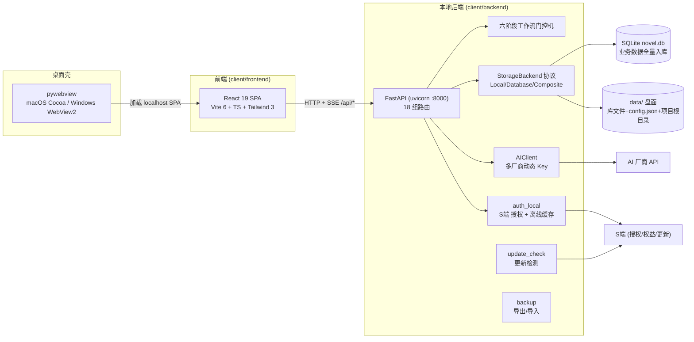
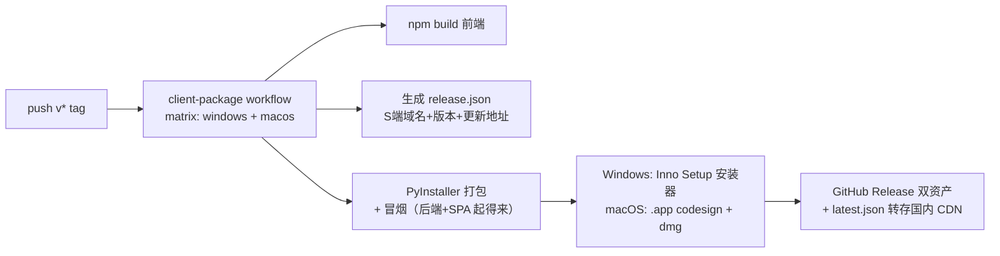

# C端 技术架构：前后端（第 2 层）

> 层次 2/3。C端（`client/`）= 单用户本地桌面应用：pywebview 壳 + React 前端 + FastAPI 本地后端 + SQLite/本地文件。
> 系统级契约与协同见 [01-system-architecture.md](01-system-architecture.md)。2026-09-11 快照。

## 1. 总体视图



- **前端不直连任何外部服务**：AI、S端 通信全部由本地后端代理，前端只讲 `localhost:8000/api` 一种方言（SSE 除外，同源）。
- **单用户模型**：JWT 中的 user_id 限定一切数据范围；文件路径 `/data/{user_id}/{project_slug}/`；所有端点操作前交叉校验 `project.user_id`。

## 2. 前端架构（client/frontend）

### 2.1 技术栈

| 维度 | 选型 |
|------|------|
| 框架 | React 19 + TypeScript 5.7（严格模式，`tsc && vite build` 门禁） |
| 构建 | Vite 6 |
| 样式 | Tailwind CSS 3.4 + 自建设计语言（oklch token，禁止裸色值） |
| 路由 | react-router-dom 7 |
| 状态 | 页内 hooks + `lib/api` 数据层（无全局 store；服务端状态即事实源） |
| 测试 | vitest + testing-library（单测/几何断言）、Playwright（e2e）、pixelmatch（设计 parity） |

### 2.2 页面结构

顶层页面 5 个，写作工作台是 `NovelLayout` 下的组件树：

```
LandingPage        落地/引导
LoginPage          登录（跳系统浏览器完成 OAuth）
ApiKeyConfigPage   AI Key 多配置管理
NovelListPage      书列表（书架）
NovelLayout        写作工作台外壳（设定三栏 / 卷章工作台 / 写作流 / 预览阅读器 / 归档）
```

### 2.3 设计语言体系（硬约束）

动手前必读三件套：`docs/ux/design-language.html`（标准层）→ `docs/design-c/prototypes/CLAUDE.md`（原型层规范）→ 原型 HTML（像素基线）。规则：

- 颜色一律 oklch token，禁裸 hex/rgb/hsl；禁两套类名并存；图标用内联 SVG 单线且必须显式定尺寸。
- 设计改动先在 `ADJUSTMENTS.md` 登记，再动实现。
- 新控件必加几何断言（jsdom 无布局，e2e 只看文本，几何靠显式断言兜）+ 截图自检；`design:check` = design-lint + 像素 parity。

### 2.4 数据与流式

- `lib/api` 封装全部后端调用；改 `lib/api` 消费方必须本地跑 vitest（CI 不跑前端单测的历史坑）。
- SSE 写作：前端按段落开流（可并行多流），消费 `text/event-stream` 事件驱动 UI；支持段落级暂停/停止。稳定回调句柄防无限刷新（预览阅读器改造沉淀）。
- e2e 通过页面级桩处理鉴权（check-auth 擦注入 token 的历史方案已废弃），本地全量跑 docker 四服务栈。

## 3. 后端架构（client/backend）

### 3.1 路由全景（main.py 注册序即加载序）

| 模块 | 职责 |
|------|------|
| `auth_local` | S端 授权：浏览器 OAuth、token/权益本地缓存、30 天滚动验证、中间件 |
| `backup` | 导出包/导入闭环（纯资产包契约，单事务全成全败） |
| `update_check` | latest.json 拉取、版本比较、白名单域校验 |
| `api_configs` | AI Key 多配置：厂商检测/连接测试/CRUD/用量统计/Fernet 加密/启动迁移 |
| `novels` | 项目（小说）主 CRUD + 导入 + 题材匹配 |
| `genres` | 全局题材库（CRUD/种子/写作链路注入）+ novel_genre 族 |
| `settings`（+ `settings_ai`） | 世界设定/文风/反AI/钩子表单 + AI 生成 + render.py 渲染收敛 |
| `chapters`（+ `chapters_ai_draft`、`chapters_versions`） | 卷章 CRUD、AI 起草章纲、章节版本管理 |
| `volumes` | 卷结构与卷子表（阶段/冲突阶梯/章计划/角色声线） |
| `prompt` | 逐段提示词组装（设定渲染经 `settings/render.py` 单点） |
| `write`（+ `auxiliary`、`quality`、`chapter_writer`） | SSE 流式写作 + 辅助写作（续写/润色/扩写）+ 质量检查 |
| `archive` / `archives` / `legacy_archive` | 归档定稿、归档阅读器、旧档兼容 |
| `story`（+ `story_arc_wizard`） | 剧情推演引擎 + 主线拆纲向导 |
| `workflow`（+ `workflow_backfill`） | 阶段机 + gate 验证 + 存量回填 |
| `threads`、`projects`、`novel` | 历史遗留（见 §6 债务） |

### 3.2 六阶段工作流门控机

```
init → settings → outline → prompt → write → archive
              ↑______________write→outline（唯一反向流转：写下一章）
```

- 每个流转经 `workflow/gates.py` 验证前置条件；不满足 → 400 + 缺失项清单，前端据此渲染门禁。
- 状态推进不可跳级；确认章纲等操作有整表单刷新竞态的既有防护约定。

### 3.3 存储层：全量入库后的访问纪律

> 演进三步：文件时代 → ADR-001 设定入 KV → **全量入库**（#159–#163，卷/章/正文/版本/归档/提示词全部迁入各自 DB 表）。**盘上不再有任何业务文件**，`data/` 只剩库文件、config.json 与项目根空目录。数据面细节见 [04-data-architecture.md](04-data-architecture.md)。

- `CompositeStorageBackend` 文件路由只剩项目根目录的创建/删除；`PATH_TO_KEY` 把 9 类设定 + threads 路由到 `project_settings` KV（每路径唯一属主，非镜像）。
- 卷/章等业务实体经 `repositories/`（chapter_repo/volume_repo）直查表，不再过存储路由；调用方仍一律走 `get_storage()`/仓储抽象，禁止直连盘面。
- 大字段纪律：全库仅五处 TEXT（正文/段提示词/版本快照/归档/生成提示词）。
- schema 演进走"指纹留档 + 资产包救回"，库层零迁移零召回；导出/导入双包是改名迁移的合并门禁。

### 3.4 数据模型（SQLite，25+ 表）

| 域 | 表 |
|----|----|
| 身份/配置 | users、api_configs、app_meta |
| 小说主体 | novels、volumes + 4 卷子表（stages/conflict_ladders/chapter_plans/character_voices）、chapters + 12 章子表（key_points/characters/scene_cards/micro_payoffs/payoff_items/downtime_functions/key_choices/required_changes/prohibitions/knowledge_states/segments）、chapter_contents、chapter_versions、chapter_prompts |
| 设定 KV | project_settings |
| 题材 | genres、genre_vocab、novel_genre、novel_genre_forbidden、novel_genre_battlefield |
| 归档 | archives |
| 记账/审计 | token_log、project_model_audit_log、events |

要点：表名已统一 `novels`（命名迁移后）；ORM 类名 `Novel` 住 `models/project.py`（历史路径，属已知债务）。TokenLog 记每次 AI 调用的输入/输出 token 用量。

### 3.5 AI 客户端（ai_client.py + api_configs）

- **多配置**：用户可存多份 API 配置（厂商/协议/base_url/key/model），支持连接测试与用量统计；Key 经 Fernet 加密落盘（`.fernet_key` 自动生成）。
- **AIClient**：Anthropic / OpenAI 兼容双协议（`api_format`），`chat` / `chat_stream` 双模式；模型名解析（resolve）；对不支持 temperature/thinking 的模型自动降参并记忆（`_remember_thinking_unsupported`）。
- **获取入口**：`get_ai_client_for_user` / `get_ai_client_for_novel`（按书解析其绑定配置）——AI 调用分层（C端 AI 调用链分层改造后）：不同链路（设定生成/章纲/正文/辅助）取各自配置。
- 每次调用落 TokenLog。

### 3.6 SSE 写作链

`write/router.py` 返回 `StreamingResponse(media_type="text/event-stream")`：一段一连接，前端可并行多流；`chapter_writer.py` 编排提示词（prompt 组装 + 设定渲染）→ AIClient 流式 → 事件回推；`quality.py` 质量检查；暂停/取消由前端事件驱动后端中止。

### 3.7 授权与本地安全（auth_local）

- 服务端地址解析链：`config.json server_api` → env `SERVER_API_BASE` → 兜底；裸域名自动补 `/api`；`SERVER_API_FALLBACK` 主基址失败自动切。
- 授权：拼 `/auth` 授权页 URL（web origin 由 PUBLIC_SERVER_API 剥 `/api` 得到）→ 系统浏览器完成 → 本地拿 token → 30 天滚动 verify → 离线缓存（含权益快照）。
- 本地 API 无鉴权暴露面：只绑 127.0.0.1/容器内网；多租户隔离靠 JWT user_id + 文件路径。

## 4. 打包与发版（client/packaging）



- `release.json` 烘进包（build.spec datas），冒烟前置断言必须真实打进产物；`client_version`：tag 构建写真实版号，PR/手动写 dev（跳过更新检测）。
- 运行时优先级：用户手工 config.json / env > 包内 release.json（`pywebview_app.start_server` 注入）。
- 数据目录 = 安装目录下 `data/`，整个文件夹可搬；未签名 dmg 走"系统设置→仍要打开"指引（已拍板不购 Apple Developer）。

## 5. 测试体系

| 层 | 工具 | 门禁 |
|----|------|------|
| 后端单测 | pytest（容器内模板已入镜像） | PR CI + 部署前全量 |
| 前端单测/几何 | vitest + testing-library + jsdom | **CI 不跑，本地必跑**（改 lib/api 与交互时） |
| e2e | Playwright @ docker 四服务栈（5174/8000） | 每日定时 CI + 改交互本地全量 |
| 设计 parity | design-lint + pixelmatch 截图对比 | `design:check` |
| 打包冒烟 | exe/.app 启动冒烟（backend+SPA） | tag 构建强制 |

## 6. 已知债务与遗留

- **命名迁移残留**：`client/backend/{novel,projects,threads}/` 只剩 `__pycache__`（死目录）；`models/project.py` 承载 `Novel` 类、子表列 `project_id`、`project_settings` KV 表等一物三名痕迹。**2026-09-11 拍板：全系统统一一名（novel）**——DB 列名层须立项走指纹留档迁移（勿裸改），符号层可机械替换，新代码/新表一律 `novel_id`；已记 todo.md。
- **CI 不跑前端单测**：vitest 只能本地跑，历史上 main 曾 3 处失败未察觉。
- **本地 e2e 存量红**：config-page Undo / v01 B5 / U3 在 main 同挂（B5 疑 docker S端 不认 admin123），勿误判新回归。
- **parity 字体光栅漂移**：main 本机跑 `design:check` 亦红，属环境差异存量。
- **打包鉴权基址**：全新安装包无 config.json 时依赖包内 release.json/兜底基址，本地仓库 data/config.json 侥幸可通——加固提议（占位默认改云托管直连）曾停待批。
