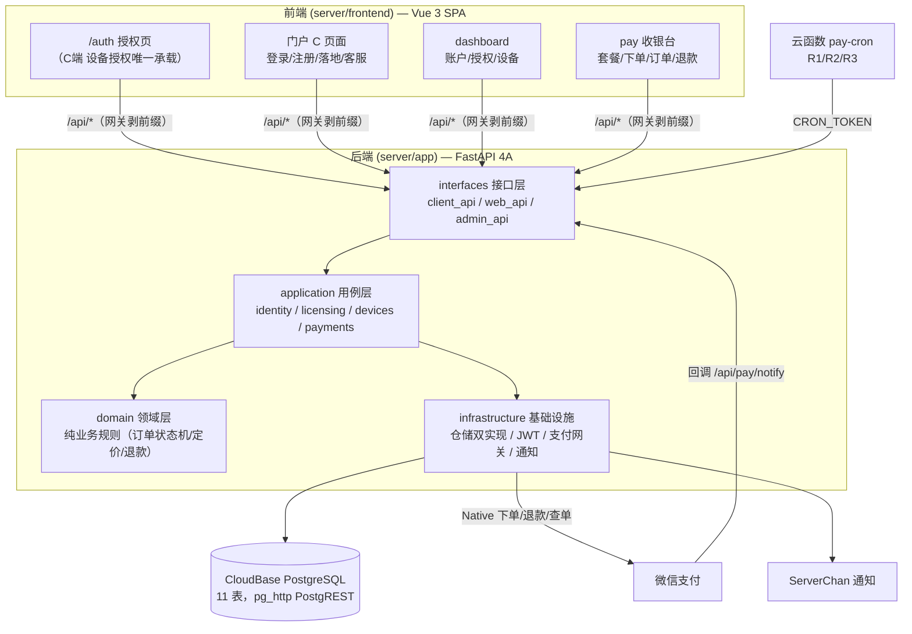
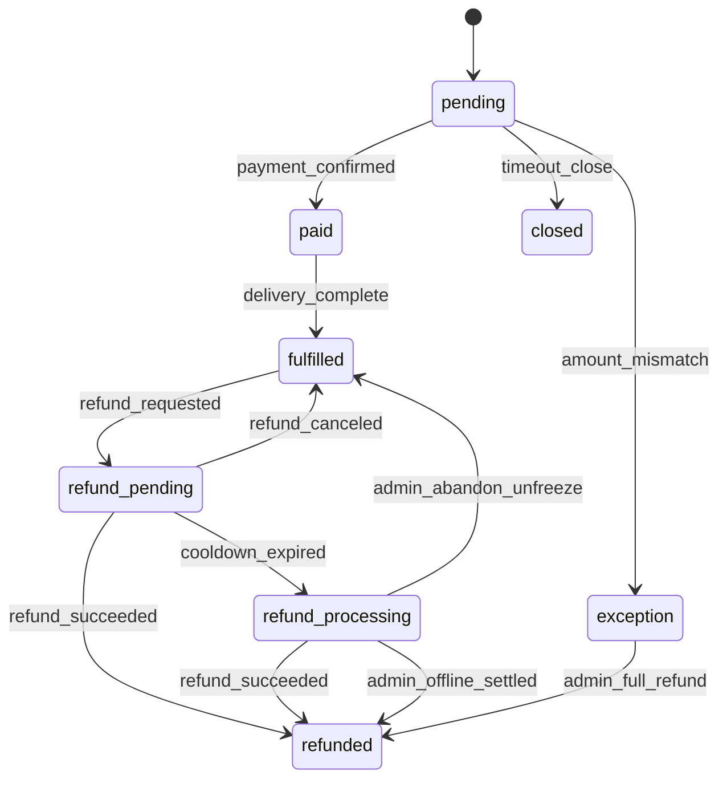
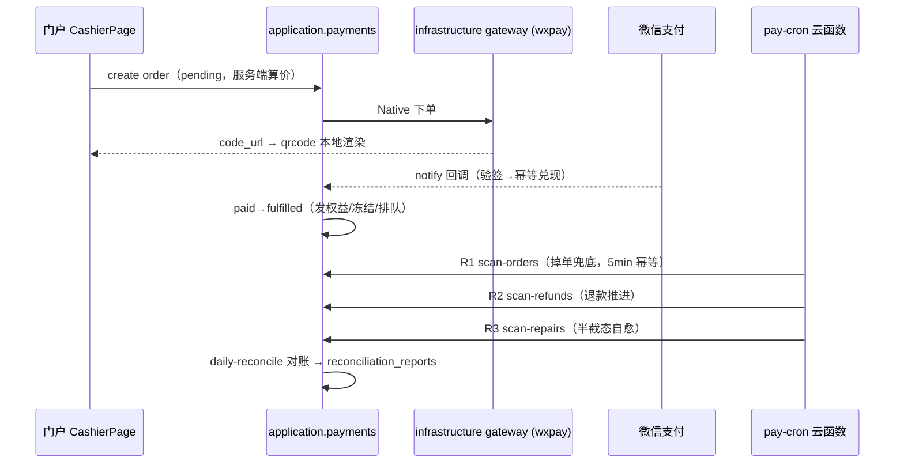

# S端 技术架构：前后端（第 3 层）

> 层次 3/3。S端（`server/`）= License 授权、设备管理、权益与支付服务：FastAPI 4A 分层后端 + Vue 3 门户 SPA，部署于腾讯云 CloudBase。
> 系统级契约见 [01-system-architecture.md](01-system-architecture.md)。2026-09-11 快照。

## 1. 总体视图

## 2. 后端：4A 分层架构

依赖方向严格单向：`interfaces → application → domain`，`infrastructure` 实现 application/domain 定义的接口（仓储 Protocol），服务层只依赖接口——`DB_BACKEND` 切库只改环境变量。

### 2.1 interfaces（接口层，三组路由）

| 路由组 | 消费方 | 覆盖端点 |
|--------|--------|---------|
| `client_api` | **C端 本地后端** | `/api/verify`（30 天滚动验证）、`/api/authorize`（设备授权）、设备族（`/api/devices/current|my|remove|consume-enrolled`） |
| `web_api` | **浏览器门户 SPA** | 账户（web/login、web/register、check-auth、user/me、password/preferences/security、注销三件套 deletion+refund-request+revoke）、支付（`/api/pay/*`：skus 目录、orders 建/查/取消/退款/退款预览、pending）、回调（`/api/pay/notify`）、cron（`/api/cron/scan-orders|scan-refunds|scan-repairs|daily-reconcile`）、dev 注入（仅 mock 网关注册） |
| `admin_api` | **运营（ADMIN_TOKEN）** | 出码 `/api/generate_code`、查码 `/api/query_codes`、激活 `/api/codes/activate`、删除资产扫描 `/api/admin/deletion-scan` |

横切件（注册顺序即洋葱序）：CORS → **前缀归一化中间件**（网关剥掉的 `/api` 前缀在此补回，路由表先收齐再注册）→ 限流 → 访问日志。中间件是 `www /api/*` 路由契约的兜底层。

### 2.2 application（用例层）

按域分四组编排用例：`identity`（注册/登录/账户安全）、`licensing`（码/权益）、`devices`（绑定/验证 verify_license/解绑/消费名额）、`payments`（下单/回调兑现/退款/关单/对账）。用例是无状态函数式编排，输入仓储接口 + 参数。

### 2.3 domain（领域层，纯 Python 零框架依赖）

- `payments/order.py`：**订单状态机**（核心资产）。状态集：`pending / paid / fulfilled / refund_pending / refund_processing / refunded / closed / exception`；转移表显式声明（`Transition(from, trigger, to)`），非法转移抛 `InvalidTransition`：

- `payments/pricing.py`：服务端算价（防前端价被改）。
- `payments/refund.py`：退款规则——冷静期、退款确认即冻结权益（frozen 全链）、排队激活顺延 active+frozen。
- `licensing` / `devices` / `identity`：授权码语义、设备绑定上限、验证窗口规则。

### 2.4 infrastructure（基础设施）

| 组件 | 内容 |
|------|------|
| `repositories/` | 5 个仓储 Protocol + **双实现**：`sqlite`（SQLAlchemy，本地/测试默认）与 `pg_http`（CloudBase PostgREST HTTP + API Key，生产）；工厂按 `DB_BACKEND` 装配 |
| `security/` | JWT 签发/校验（**token 含 uid claim**，web 端点免回查 users）、密码哈希 |
| `payments/` | 网关抽象 `gateway.py` + `wechatpay.py`（微信 Native：下单/查单/关单/退款/回调验签；`PAYMENTS_GATEWAY` 空=mock，wxpay 时密钥缺失 fail-fast 拒启） |
| `notify.py` | ServerChan 告警通知（空 SendKey 降级为日志） |
| `pg_schema.py` | **启动自检**：生产 PG schema 与期望结构对拍（pg_gate 门禁的运行时侧） |
| `gateway_stub.py` / `logging.py` | mock 网关 / 结构化日志 |

**PG 双实现的由来**：体验版 CloudBase PG 无 TCP 直连（无连接地址/账号），SQLAlchemy 连不上——`pg_http` 走 PostgREST + API Key（service_role 语义绕 RLS）是唯一生产路径。建表不走 alembic（它只跑 sqlite）：生产 schema 由 MCP `applyMigration` 预建并打标 `alembic_version`，`pg_http` 启动跳迁移、靠启动自检兜结构漂移。

### 2.5 数据模型（11 表）

| 域 | 表 | 说明 |
|----|----|------|
| 身份 | `users` | 账号、密码哈希、偏好 |
| 设备 | `device_registry` | pc_hash 绑定、设备状态 |
| 授权 | `codes`、`device_grants` | 激活码池；设备级授权 grant |
| 配置 | `global_config` | 运行时全局配置 KV |
| 商品 | `tiers`、`skus` | 套餐档位与 SKU（三档矩阵，价格随 DB 走） |
| 交易 | `orders`、`trade_events` | 订单（状态机宿主）；交易事件台账（状态迁移/冲正审计） |
| 财务 | `reconciliation_reports`、`invoices` | 每日对账报告；发票 |

时区纪律：所有 `created_at` 等由应用显式传 naive UTC，不依赖 DB DEFAULT `now()`；上海时区只在前端 `fmtBj`（`api/pay.ts` 唯一转换点）。

## 3. 前端：Vue 3 门户 SPA

### 3.1 技术栈

Vue 3.5 + Vite 6 + TypeScript（`vue-tsc` 门禁）+ Pinia + Vue Router + axios + qrcode（二维码本地渲染，**不用第三方码图服务**，防 code_url 外泄）+ Tailwind 4/daisyUI。E2E 用 Playwright（**全 mock 后端**，约 82 条，PR CI 强制）。

### 3.2 视图清单

| 区 | 视图 | 角色 |
|----|------|------|
| 授权/公共 | `AuthPage`（/auth）、`LoginPage`、`RegisterPage`、`LandingPage`、`SupportPage`、`NotFoundPage` | /auth 是 C端 设备授权唯一承载；登录注册供账户体系与支付前置 |
| dashboard | `DashboardHome`、`AccountPage`、`LicensePage`、`DevicesPage` | 登录后账户域：会员资格、设备管理 |
| pay | `CashierPage`、`OrdersPage`、`OrderDetailPage`、`RefundPage` | 收银台：三档矩阵选套餐 → Native 扫码 → 订单/时间线 → 退款（冷静期/过渡展示态） |

### 3.3 关键交互契约

- 收银台协议行（真链接全文 + 勾选）、「立即激活」就地真激活、排队码 grant_start 口径（展示错≠钱错）均为已拍板 spec（s-pay-cashier / s-pay-account-views）。
- 弹窗**只准 AppModal**，禁手写 scrim/modal（隐形遮罩事故后立的禁令）。
- 订单时间线用 `fulfilled_at` 硬口径；分页/分版端点与后端 spec 同批出。

## 4. 支付与对账链路

- **幂等**：回调重放、关单 5min 间隔、多服务器并发进 CAS 测试范围。
- **台账**：每次状态迁移落 `trade_events`（已知缺口：R3 自愈半截态建议补 frozen/unfrozen 事件）。
- **对账**：daily-reconcile 产出 `reconciliation_reports`；mismatch 单人工处置（exception → admin_full_refund）。
- 退款链：`refund_preview` → 申请（冷静期 `refund_pending`）→ 提交微信（`refund_processing`）→ `refunded`；取消退款回 `fulfilled`。IP 白名单保持关闭（拍板）；上报接口不接（拍板）。

## 5. 部署与运维

### 5.1 发布链

- **触发**：`v*` tag 或手动 dispatch（`s-server-deploy`，concurrency 串行化——平台同时只允许一个部署任务）。
- **后端**：tcb 云端构建容器镜像部署 CloudRun `novel-s-server`；**envParams 是全量覆盖**（控制台手加的变量会被冲掉），secrets 全走 GitHub Secrets 注入；`WXPAY_*` 缺失语义安全（空 gateway 回落 mock；wxpay 模式缺失即拒启）。
- **前端**：CI 构建 dist → 静态托管/webapps；CI 跨境超时时走 MCP `manageHosting`/`manageApps` 直传兜底（既定路线，域名 `novel-s-web` 版本化）。
- **改懒加载组件 ≠ 免重建**：单文件免重建只对纯 JSON/同路径图片生效，组件改动必须全量传 dist。

### 5.2 生产 schema 治理

- alembic 只管 sqlite；生产 PG 由迁移工具预建 + `pg_gate` CI 门禁（防结构漂移/漏 server_default/漏表）+ 启动自检双防线。
- **先 DML 后合并**原则：涉及数据的变更先在生产验证再合 PR。

### 5.3 域名与入口

- `www.awesomenovel.com` 唯一入口（apex 裸域已拍板删除解析）；`/api/*` 网关剥前缀转发 CloudRun；`/download` 直达 CDN 承接安装包/latest.json。
- 站点配置（备案号/客服邮箱等）运行时读 `site-config.json`，换备案号只改 JSON 重传。

## 6. 测试体系

| 层 | 工具 | 说明 |
|----|------|------|
| 单测/契约 | pytest（含 TZ 抗性测试、entitlement 对拍、pg_gate 期望表） | PR CI；部署前全量门禁 |
| e2e | Playwright 全 mock（后端接口层 stub） | PR CI 约 1m20s；密闭性验证法=停 mock 后端复跑 |
| 生产探针 | `probe:beian`、skus/chunk 哈希对拍、DOM 快照 | 线上验证不走浏览器目测 |

**sqlite 全绿 ≠ 生产可用**的历史教训：pg_http 与 sqlite 行为差异（类型透传/默认值/时区）是历次生产事故主源，契约测试必须覆盖双实现。

## 7. 已知债务与遗留

- entitlement 契约挂起项：5.3/5.4/5.6 与遗留立项三件（entitlement-sync 归档记录）。
- R3 自愈不落 `trade_events`（建议补 codes:frozen/unfrozen 事件）——评审唯一 P3。
- 台账 2126 日期 bug + active 码不收回，待立项。
- campaigns 活动模型 + 服务端算价深化（套餐选购页二期移交项）。
- S端 后端 CI main 存量红 = ruff 全仓违规（历史基线，勿误判新回归）。
- 服务端算价已立 `pricing.py`，但营销价/折扣仍部分依赖 SKU 数据配置（二期收口）。
