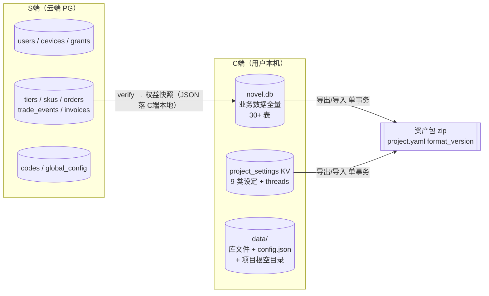
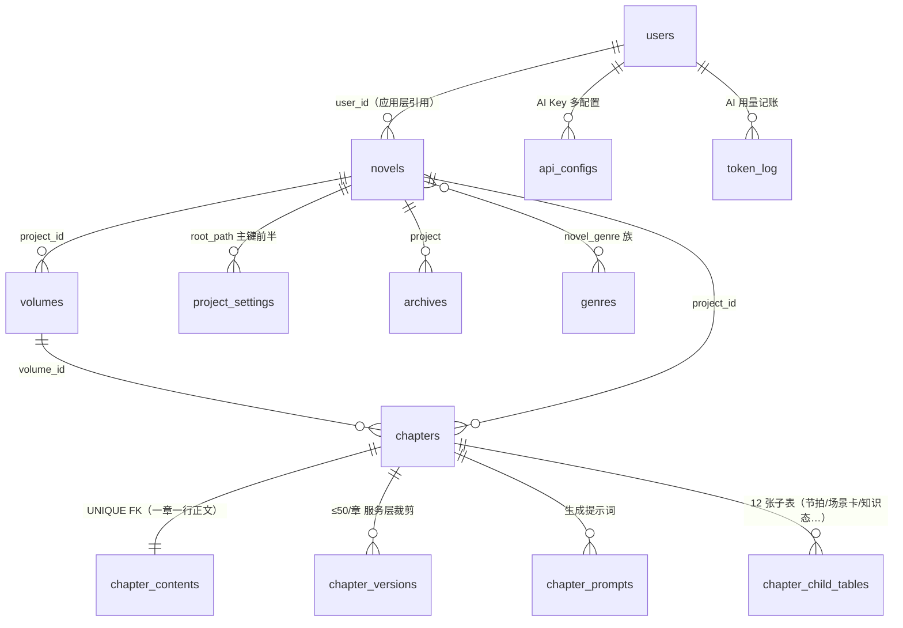
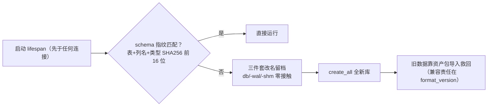
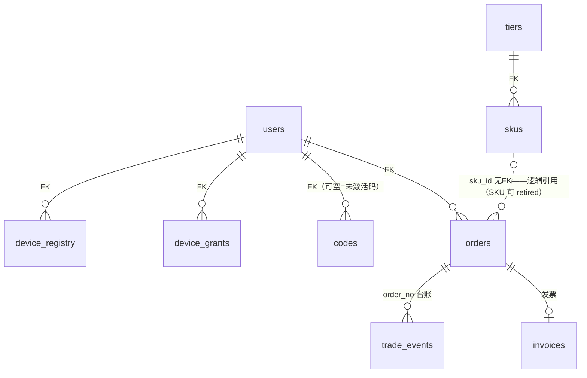
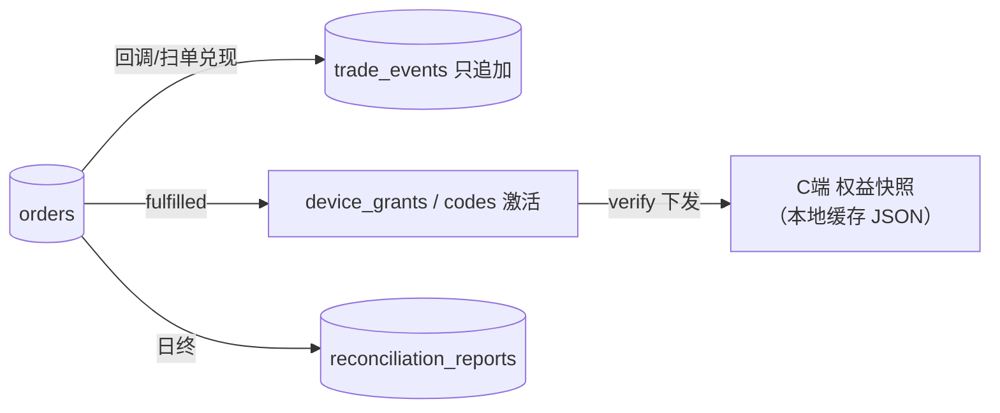

# 数据架构（第 4 层）

> 本文回答"数据长什么样、住在哪、怎么流动、怎么演进"。系统协同见 [01](01-system-architecture.md)，单端结构见 [02](02-c-client-architecture.md) / [03](03-s-server-architecture.md)。
> 事实来源是代码与实际数据目录；2026-09-11 快照。

## 0. 一句话总纲

**C端：单库事实源**——SQLite `novel.db` 承载全部业务数据（全量入库迁移后，盘上不再有任何业务文件）；**S端：单库账本**——CloudBase PG 11 表承载身份/授权/交易，只追加的 `trade_events` 台账是钱的唯一审计线。两端各自自治，唯一跨端数据流是"权益快照下行"与"资产包导出/导入"。



## 1. C端 数据架构

### 1.1 演进史（理解现状的前提）

1. **文件时代**：`data/projects/{user_id}/{slug}/` 下 story.yaml、chapters/ 等全套文件（README 旧图即此态）。
2. **ADR-001 设定入库**：9 类设定 + threads 经组合路由写 `project_settings` KV，其余仍文件。
3. **全量入库（#159–#163，5-PR 迁移）**：卷/章/正文/版本/归档/提示词**全部迁入各自 DB 表**。数据=表，文件名=派生字符串。

**现状**：`CompositeStorageBackend` 的文件路由只剩项目根目录的创建/删除；盘上业务文件为零（本地 `data/` 实测只有 `novel.db`+`config.json`）。根 CLAUDE.md/README 中"正文存文件"的表述是 ADR-001 时代旧口径，已过期。

### 1.2 存储访问纪律

- 一切数据读写仍经 `filesystem/storage.py` 的 `get_storage()` 协议（yaml/md 抽象通道保留）；卷/章等业务实体走 `repositories/`（chapter_repo/volume_repo）直查表，不再过存储路由。
- `PATH_TO_KEY` 路由映射（`filesystem/paths.py`，纯函数）：8 类单文件设定（story/world/style/anti-ai/hooks/genre/ai-model/status）+ `threads.yaml` + `character:{name}` 前缀 → `project_settings` 表；md 通道显式走文件（非设定类杂项文本）。
- `project_settings` 结构：PK = `(root_path, key)`，`content` 为 JSON 序列化 Text——**每路径唯一属主，非镜像**（同一设定不存在第二份存储）。
- 文件层安全：原子写（临时文件 + `os.replace` 防半截）、`_safe()` 组件级路径穿越校验。

### 1.3 数据模型全景（30+ 表）



| 域 | 表 | 备注 |
|----|----|------|
| 身份/配置 | users、api_configs、app_meta | api_configs 的 Key 经 Fernet 加密 |
| 小说主体 | novels、volumes + 4 卷子表、chapters + 12 章子表 | chapters 用 `ref` 字符串寻址 + chapter_no 序号；子表经 mixin 挂 chapter_id |
| 正文/版本 | chapter_contents（1:1）、chapter_versions（1:N） | version = 13 位毫秒时间戳 BIGINT，字典序即时间序；snapshot 冻结章 JSON |
| 设定 KV | project_settings | 见 §1.2 |
| 题材 | genres、genre_vocab、novel_genre、novel_genre_forbidden、novel_genre_battlefield | 全局库 + 书级关联/禁用/战场 |
| 归档/提示词 | archives、chapter_prompts | 归档定稿原文 |
| 记账/审计 | token_log、project_model_audit_log、events | token_log 只在本机，S端 零感知 |

**大字段纪律**：全库仅 **五处 TEXT**（prose 正文 / segment 提示词 / 版本快照 / 归档 / 生成提示词），其余一律短字段——这是全量入库后控制库体与查询宽度的显式设计约束，新增大文本字段前先对照此清单。

### 1.4 磁盘布局现状

```
{DATA_ROOT}/
├── novel.db (+ -wal/-shm)     # 唯一业务数据库
├── config.json                # 应用配置（S端基址等，非业务数据）
├── .fernet_key                # API Key 加密密钥（自动生成）
└── projects/{user_id}/{slug}/ # 仅空根目录（init_skeleton 建，语义锚点）
data.legacy/                   # 旧文件时代留档（迁移遗留，只增不删）
```

### 1.5 schema 演进：指纹留档 + 包契约兜兼容

C端 库层**零迁移、零召回**（`legacy_archive.py` 拍板的单轨升级）：



- 留档只增不删，唯一消费面 `/api/backup/legacy-db/status`（只读）。
- 演进宪法：**加键兼容（不升 format_version）/ 改布局升版 + 旧版读窗**；改名=重大迁移须三件套（登记/迁移/演练）。
- 日常增量由 lifespan 启动迁移（幂等台阶）承载。

### 1.6 资产包契约（数据的跨机形态）

双包制（backup 模块）：

| 包 | 内容 | 契约头 |
|----|------|--------|
| 书资产包 | `project.yaml`（契约头 + 书元数据）+ settings 树 + 卷章全字段 yaml + `archives/`（原文 + `manifest.yaml` 旁路补元数据） | `format_version` |
| 配置包 | api_configs 等应用侧配置（Key 脱敏预览 `config_preview`） | 同一 `format_version` |

- **立包边界原则**（已拍板）：包只装小说资产，应用侧历史/记账永不随包。检验=丢了心疼吗。
- 给代码读的一律 yaml（DB 无关，禁大模型解析）；versions/prompts/archives 原文永不重排。
- 导入=单事务全成全败；是任何 schema 改名迁移的合并门禁（验收必含删库救回演练）。
- 双层保险：`.bak` 全量本机回滚（同机同版本）+ 导出包纯资产跨机保底（跨版本）。

### 1.7 数据安全

- API Key：Fernet 对称加密，密钥 `{DATA_ROOT}/.fernet_key` 自动生成——**丢 key = 丢配置**（在配置包覆盖范围外的部分需重填）。
- 本地 API 只绑 127.0.0.1/容器内网；多租户隔离靠 user_id 应用层校验（C端 实为单用户，字段存在是为与 S端 对齐）。

## 2. S端 数据架构

### 2.1 双仓储单接口

- 5 个仓储 Protocol（`infrastructure/repositories/base.py`）定义全部数据访问面；`DB_BACKEND=sqlite|pg_http` 工厂装配。
- `pg_http` = PostgREST HTTP API + 环境 API Key（service_role 语义）：**体验版 PG 无 TCP 直连，HTTP 是唯一路径**。
- 跨实现坑位（契约测试须覆盖双实现）：省略字段走列 DEFAULT（曾致空串 FK）；`eq.` 是合法过滤语法，401≠语法错；sqlite 全绿≠生产可用。

### 2.2 数据模型（11 表）与关系



| 表 | 关键设计 |
|----|---------|
| `users` | 账号/密码哈希/偏好；JWT 含 uid 后 web 端点免回查 |
| `device_registry` | pc_hash 绑定，user_id FK |
| `codes` / `device_grants` | 激活码池；设备级授权 grant（命名拍板：grant 已退役为 authorization 语义的存量表） |
| `global_config` | 运行时 KV |
| `tiers` | key 唯一、rank 排序（max30/pro20/trial10）、`entitlement` JSON（与 entitlement-defaults.json 对拍） |
| `skus` | 金额一律**分**（base_price_fen），折扣千分比（discount_permille），device_limit，on_sale |
| `orders` | **下单快照原则**：`sku_snapshot` JSON 固化成交瞬间价格/权益，SKU 后续改价/retired 不影响存量单（sku_id 故意无 FK）；`agreement_version/agreed_at` 协议留痕；退款字段内联（refund_status/amount/operator…） |
| `trade_events` | **只追加台账**，钱的每一次状态迁移一行，审计唯一真相 |
| `reconciliation_reports` / `invoices` | 日对账产物 / 发票 |

本体论纪律：状态/动作/属性只属一个对象；名字取自实存域对象零新词（code=代码、entitlement=权益、license=会员资格、device authorization=设备授权）。

### 2.3 数据流：钱与权益



- 退款确认即冻结（frozen 全链接线）；排队激活顺延 active+frozen。
- 已知缺口：R3 自愈半截态不落 trade_events（建议补 codes:frozen/unfrozen 事件）。

### 2.4 schema 治理

- alembic 只跑 sqlite；生产 PG 由 MCP `applyMigration` 预建 + 打标 `alembic_version`，`pg_http` 启动跳迁移。
- 双防线：`pg_gate` CI 门禁（结构漂移/漏 server_default/期望默认值对拍 `EXPECTED_DEFAULTS⊆REQUIRED`）+ `pg_schema.py` 启动自检。
- **先 DML 后合并**：涉及数据的变更先生产验证再合 PR。
- 时区：应用显式传 naive UTC，禁 DB DEFAULT `now()` 兜时间。

## 3. 跨端数据流清单

| # | 流 | 方向 | 载体 | 频率 |
|---|----|------|------|------|
| 1 | 权益快照（tier/features/limits） | S端 → C端 | verify 响应 → 本地缓存 | 登录 + 30 天滚动 |
| 2 | 授权码激活结果 | S端 → C端 | codes/activate | 手动 |
| 3 | 更新元数据 | CDN → C端 | latest.json | 定期 |
| 4 | 书资产/配置包 | C端 ↔ 任意机器 | zip（format_version） | 手动 |
| 5 | AI 用量 | C端 本地 token_log | **不跨端** | — |
| 6 | 订单/支付 | 用户浏览器 ↔ S端 | **不经 C端** | 购买时 |

设计意图：跨端面越窄越好。除 1/2 两个授权语义流外，没有任何小说业务数据出本机。

## 4. 数据治理红线

1. C端 全库仅五处 TEXT；新增大字段先对照清单（§1.3）。
2. C端 库层零迁移：schema 变更走指纹留档 + 包契约救回，禁止手写 ALTER 迁移链。
3. 包契约演进：加键兼容不升版、改布局必升版带旧版读窗；导入门禁含删库救回演练。
4. S端 金额一律分、折扣一律千分比，禁止浮点钱。
5. S端 订单引用 SKU 必须快照（sku_snapshot），禁止活引用。
6. 钱的状态迁移必须落 trade_events 台账（R3 缺口为待补债务）。
7. 双端时区：存储 naive UTC，展示层上海时区唯一转换点。
8. 每张新表登记归属域（C端/S端、业务/记账），对账表 8 随包 + 6 界外为契约验收基准。
9. **novel 一名纪律（2026-09-11 拍板）**：小说实体全系统统一为 novel；存量 `project_id` 列与 `project_settings` 等为待迁移既成名——改动须立项走指纹留档迁移（勿裸改），在此之前新代码/新表一律 `novel_id`，不再扩散 project。清单见 todo.md。
