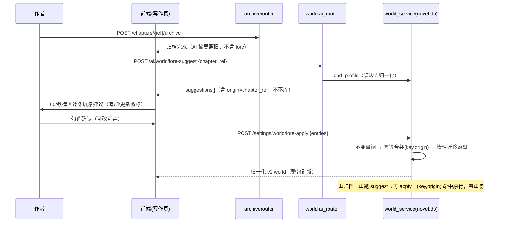
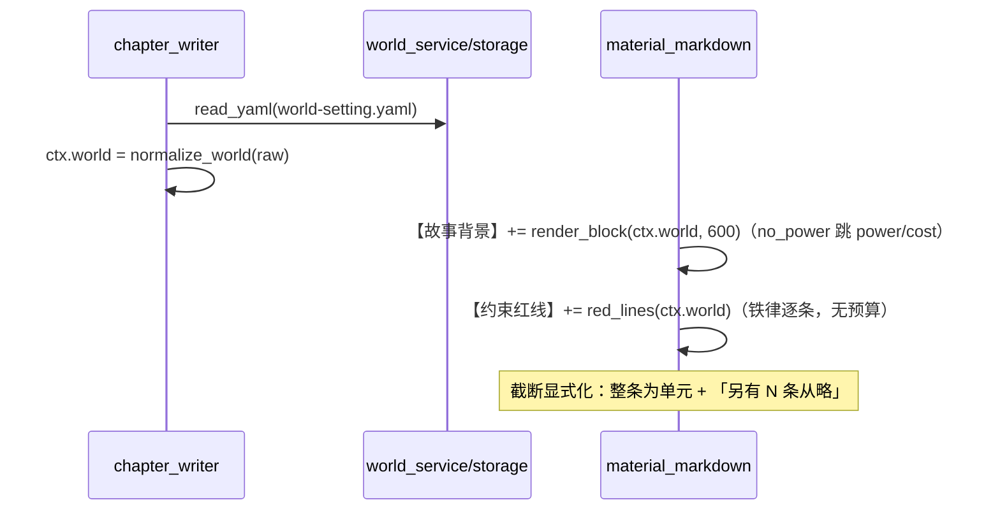

# 世界设定（world）契约 v2 — C端后端技术架构规范

| 项 | 值 |
|---|---|
| 规范版本 | v1.0（对应设计稿 world-setting-draft.html v2.7） |
| 范围 | `client/backend`（C端）世界设定域：契约 v2、迁移、AI 五行、一致性体检、lore-keeping、写章注入 |
| 读者 | openspec 变更作者、后端实现者、评审者 |
| 上游文档 | `docs/design-c/drafts/world-setting-draft.html`（v2.7，已拍板口径以其「口径前提 / 终态结构 / 迁移映射表」为准） |
| 性质 | 规范级：可直接指导 openspec 任务拆分与编码；标注【拍板】的条目按本规范执行，标注【留 openspec】的条目在 change 内复核 |

---

## 0. 硬约束（仓库既定事实，违反即返工）

1. **本机 SQLite 单存储，零 DDL**：C端是本地单机应用，数据只存本机 `novel.db`（`config.py:12` `DATABASE_URL` 默认 `sqlite+aiosqlite:///{DATA_ROOT}/novel.db`）——设定、正文、角色、归档同库同事务生态；全 client/backend 无 PG（PG 是 S端 CloudBase 的事，与本域无关）。world 设定经 `filesystem/paths.py` 的 `PATH_TO_KEY`（`settings/world-setting.yaml` → key `"world"`）由 `filesystem/composite_storage.py` 路由到 `filesystem/db_storage.py` 的 `DatabaseFileBackend`，落 `project_settings` 表（`root_path + key` 复合主键，`content` 为 JSON Text 列）。契约 v2 是 **content 形状演进，不改表结构、不新增列、不写任何迁移**。
2. **alembic 不覆盖 KV 值**：C端本 change 零 DDL、零 alembic（C端仓库无 alembic 目录；alembic 属 S端）；任何 schema 迁移不得读写 `project_settings.content`。v1→v2 数据迁移是**读边界归一化 + 惰性落盘**（见 §3.3），不是数据库迁移。
3. **naive UTC**：一切时刻取 `datetime.now(UTC).replace(tzinfo=None)`，日期取 `datetime.now(UTC).date()`；禁止裸 `datetime.now()` / `date.today()`。本域涉及时间戳的只有 lore 条目 `updated_at`（可选元数据）与日志。
4. **ruff 副作用 import 禁令**：新模块导入时**不得产生 IO / 注册副作用**（不得在 module top-level 连 DB、读文件、改全局）；初始化一律显式函数调用（先例：`filesystem/init.py` 的 `seed_settings_to_db`）。领域模块（§2 `settings/world_model.py`）必须**只依赖标准库 + pydantic**，保证可被单元测试单独导入。`settings/*.py` 已有 `BLE001/S110` per-file ignore（`client/backend/ruff.toml`），新文件落 `settings/` 即继承，无需改 ruff 配置。
5. **S/C 端互不影响**：本 change 只动 `client/backend` 与 `client/frontend`；不 import `server/` 任何模块，不改 S端 schema / alembic / 仓储接口。
6. **存储访问一律经 `get_storage()` 协议**（CLAUDE.md 既有约定），禁止新代码直接文件 IO 或直接 new `DatabaseFileBackend`。
7. **PUT 语义 = 整体替换**（与 genre/style 等设定一致）；前端 merge-on-save。后端不做字段级 patch。
8. **AI 门控走既有依赖**：`require_ai_access` + `require_novel_model`（`auth_local/deps`），与 `settings/ai_router.py` 现状一致；免费锁定不新造机制。
9. **每路径唯一属主非镜像**：world 仍由 `project_settings` 表唯一持有；不引入第二份持久化（lore 建议不落新表，见 §5.6）。

---

## 1. 总体分层（DDD 四层）与落位映射

### 1.1 目标分层

C端后端现状是「按业务域分目录的 FastAPI 单体」，没有物理的 domain/application 目录。本规范定义**逻辑四层**：不要求搬迁存量文件，但**新增代码必须按层落位，层间依赖单向**：

```
interfaces（API 路由层）      settings/router.py · settings/status.py · settings/ai_router.py · archive/router.py
        │ 只做：请求/响应模型、依赖注入（auth/门控/db）、调 application、错误码翻译
        ▼
application（用例层）         settings/world_service.py（新） · archive/service.py · write/chapter_writer.py
        │ 只做：用例编排、事务边界（storage 写）、AI 客户端调用、输入组装
        ▼
domain（领域层，纯函数）      settings/world_model.py（新） · settings/render.py（先例）
        │ 只做：WorldProfile 聚合、不变量校验、v1→v2 归一化、注入渲染、体检条目白名单
        │ 禁止：import fastapi / sqlalchemy / db / filesystem / ai_client
        ▼
infrastructure（存储/外部适配）filesystem/* · models/project_setting.py · db.py · ai_client.py · prompts/*
```

**禁止跨层直调**（对存量宽容、对新增强制）：

- interfaces 不得直接 `get_storage()` / `async_session()` 读写 world（存量反例：`settings/ai_router.py:496` 在路由内读 story.yaml——该模式**不得复制**到 world 新端点）。
- domain 不得 import 任何 IO 模块；渲染器只吃 `WorldProfile`，吐 `str / list[str]`。
- application 不得绕过领域模型直接拼 v2 dict（必须经 `WorldProfile` / `normalize_world`）。
- infrastructure 不得反向 import application / interfaces。

### 1.2 现有文件 → 目标层位映射表

| 现有文件 | 现状职责 | 目标层位 | 本 change 处置 |
|---|---|---|---|
| `settings/router.py` | 设定 CRUD（world 走泛化 PUT/GET） | interfaces | world 分支改调 `world_service.save / load`；新增 `POST /lore-apply` |
| `settings/status.py` | 确认标记（READINESS_CHECKER 判空 400） | interfaces | 不动结构；行为随 readiness 新判据自动生效 |
| `settings/ai_router.py` | 设定 AI 端点（intro 特判 + 通用字段路由） | interfaces | 新增 `/ai/world/check`、`/ai/world/lore-suggest`，**注册在 `/ai/{stype}/{field}` 之前**（沿用 L7-8 的 intro 先例）；world 四行出参走新归一化 |
| `settings/render.py` | style/anti-ai → prompt 渲染（双态容忍） | domain（先例） | 不动；WorldRenderer 比照其风格 |
| `workflow/readiness.py` | 就绪判定 `_check_world` | application | 重写为读 `WorldProfile` 新判据（§3.4） |
| `write/chapter_writer.py` | 写章用例与素材包 | application | `ctx.world_setting` 改持 `WorldProfile`；世界块/红线块接 WorldRenderer（§6） |
| `prompt/context.py` | `inject_world_setting` + hooks | domain 薄渲染 + infrastructure（hooks 读盘） | `inject_world_setting` 改为委托 `settings/world_model.py` 的 v2 渲染并兼容 v1 入参；本文件保留为兼容门面 |
| `story/engine.py` | 旧六阶段引擎（读 `geography.scenes`） | application（legacy） | terrain 改读 `profile.stage`（§3.5 消费方修复 T4） |
| `archive/service.py` | 归档用例（AI 摘要 + threads + 角色） | application | **不动**；lore 建议独立成端点，不挂在归档事务里（§5.6） |
| `novels/service.py` | 项目创建（L68-70 调 `prefill_world_setting`） | application | 移除 prefill 调用点（§9 D6） |
| `ai_prefill.py` | 建书 AI 预填 world（旧形状 + `_ai_prefilled`） | （退役） | 函数删除或保留死代码均可，**调用点必须移除**；防旧键混写进 v2 文件 |
| `filesystem/{storage,composite_storage,db_storage,paths,init}.py` | 存储适配 + KV 路由 + 种子 | infrastructure | 仅改 `reference/world-setting.yaml.template` 种子为 v2 形状（§3.4）；适配代码零改动 |
| `models/project_setting.py` | KV 表模型 | infrastructure | 不动（零 DDL） |
| `ai_client.py` / `ai_state.py` | AI 客户端 / 模型门控 | infrastructure | 不动 |
| `prompts/settings_world.prompt` | 旧十字段 JSON 模板 | infrastructure（资产） | 重写为 v2 四行模板 + 体检模板（§5.4/§5.5） |
| `genres/theme_catalog.py` / `novel_genre_service.py` | 题材目录/题材读取 | domain（目录）/ application | 只读复用（体检与 w 行题材锚） |

### 1.3 新增文件清单

| 文件 | 层位 | 内容 |
|---|---|---|
| `client/backend/settings/world_model.py` | domain | `WorldProfile` / `WorldEntry` 数据结构、`WORLD_LIMITS`、`validate_world_in`（不变量）、`normalize_world`（v1→v2 归一化）、`WorldRenderer`（`render_block` / `red_lines`）、`CHECK_ITEMS`（体检条目白名单，分超自然/现实向两套） |
| `client/backend/settings/world_service.py` | application | `load_profile(root_path)`、`save_world(root_path, WorldIn)`、`apply_lore(root_path, LoreApplyIn)`、`assemble_check_input(root_path, novel_id)`、`suggest_lore(root_path, chapter_ref, novel_id)` |
| `client/backend/prompts/settings_world_stage.prompt` 等 4 个 | infrastructure | 五行中四个生成行各一模板（沿用 genre 的 per-field 先例 `_GENRE_PROMPTS`） |
| `client/backend/prompts/settings_world_check.prompt` | infrastructure | 一致性体检模板 |
| `client/backend/tests/test_world_contract.py` 等 6 个 | tests | 见 §8 |

---

## 2. 领域模型（`settings/world_model.py`）

### 2.1 聚合与实体

```python
# 全部为纯数据结构 + 纯函数；pydantic v2 可用，但领域内部比较/渲染用 dict/tuple 亦可。
# 命名即契约，前端字段一一对应（v2.7 稿 L277）。

class WorldEntry:            # 条目实体（history / extra 共用）
    key: str                 # 名目 / 事件名，≤20 字
    value: str               # 内容，≤200 字
    origin: str | None       # lore 来源章节，规范形 "vol-N-ch-M"；手填为 None

class Faction:
    name: str                # ≤20 字
    note: str                # ≤100 字（立场/诉求一句话）

class WorldProfile:          # 聚合根
    no_power: bool                    # 现实向开关（v1 文件缺省 → False）
    stage: str               # 01 世界舞台，一段话 ≤300
    power: str               # 02 力量体系 ≤300
    cost: str                # 03 力量的代价 ≤300
    history: list[WorldEntry]         # 「世界至今」活账本 ≤100 条
    factions: list[Faction]           # 04 势力 ≤6 条
    constraints: list[Constraint]     # 05 世界铁律 ≤10 条 {key,value}
    extra: list[WorldEntry]           # 06 更多世界细节 ≤50 条
    legacy: dict | None               # 迁移期 v1 原文子树（见 §3.3；渲染/判定永不读它）
```

幂等键约定（lore 回写，§4.5）：

| 条目集 | 自然键 | lore 幂等键 | 语义 |
|---|---|---|---|
| `history` / `extra` | `key`（列表内不强制唯一） | `(key, origin)` | 同 origin 重放 → 原地更新 value，不新增行 |
| `factions` | `name` | `name` | lore 按名匹配 → 更新 note |
| `constraints` | `key`（**列表内唯一**，不变量） | `key` | lore 只能**建议**新增，命中既有 key → 更新该条 value |

### 2.2 不变量（`validate_world_in`，PUT 与 lore-apply 共用同一道闸）

| # | 不变量 | 违反处置 |
|---|---|---|
| I1 | `stage/power/cost` ≤300 字（strip 后计） | 400 |
| I2 | 条目 `key` ≤20 字、`value` ≤200 字、`Faction.name` ≤20 / `note` ≤100 | 400 |
| I3 | 条数：`history ≤100`、`extra ≤50`、`factions ≤6`、`constraints ≤10` | 400 |
| I4 | `constraints` 内 `key` 唯一（strip 后比对）；重复 → 400 | 400 |
| I5 | 所有字符串拒绝控制字符 `[\x00-\x08\x0b\x0c\x0e-\x1f\x7f]` | 400 |
| I6 | `origin` 为空 或 匹配 `^vol-\d+-ch-\d+$`（与 `prompt/context._canonical_chapter_ref` 同规范形） | 400 |
| I7 | `no_power=true` **不清空** `power/cost`（允许两者共存，注入/体检负责跳过）；后端不提供「开关即删值」的隐式行为 | —（语义约定） |
| I8 | 未知顶层字段一律丢弃（**`_legacy` 除外**，原样保留透传）；防止前端多传字段撑爆 KV | 静默丢弃 |

上限值是本规范拍板的建议值（设计稿未定量），见 §9 D3，openspec 可调参不改结构。

### 2.3 领域服务（全部纯函数）

```python
def normalize_world(raw: dict) -> WorldProfile
    """v1|v2|混合 dict → WorldProfile。读边界唯一入口（§3.3）。
    - 识别 v1：存在 geography/politics/rules 三组 dict → 按拍板映射表转换（§3.3 表）；
      同名 v2 字段优先（已迁移过的文件不会同时有两套，防御性取 v2）。
    - 超限/非法条目：静默截断或丢弃（读路径不抛错，与 settings/render.py 双态容忍同风格）。
    """

def render_block(p: WorldProfile, budget: int = 600) -> str
    """世界块：见 §6.1。budget 内渲染，截断处给「（另有 N 条从略）」显式标记。"""

def red_lines(p: WorldProfile) -> list[str]
    """铁律行：["世界铁律·{key}：{value}", ...]。no_power 不影响铁律。每行 _trim 200。"""

def check_items(no_power: bool) -> list[str]
    """体检条目名白名单（两套）：见 §5.5。"""
```

### 2.4 readiness 新判据（`workflow/readiness.py::_check_world` 重写）

```python
可确认 = normalize_world(world).非空
非空 ≜ stage/power/cost 任一 strip 非空  OR  history/factions/constraints/extra 任一条目 value（或 name）strip 非空
```

与 v2.7 稿 L484「可确认判据」逐字一致。`legacy` 子树**不参与**判定（防止迁移残留让空书误判已填）。阈值常量 `WORLD_DETAILS_THRESHOLD` 删除。确认流（`settings/status.py` 的空内容 400）机制不变。

---

## 3. 数据架构

### 3.1 本机 SQLite 单存储读写流

C端唯一存储 = 本机 `novel.db`（aiosqlite）。world 设定与小说正文、角色、归档**同库**，同属一个 SQLite 事务生态；不存在文件/DB 双写、不存在远端库。`LocalFileBackend` 只剩项目根目录创建/删除（`init_skeleton`/`delete_root`），world 路径对其**不可达**（composite 全路由到 DB），盘上无该文件，排障勿去文件系统找。

```
调用方（router / world_service / chapter_writer / readiness）
   │  get_storage()                                    ← 唯一入口（协议）
   ▼
CompositeStorageBackend.read_yaml/write_yaml(root_path, "settings/world-setting.yaml")
   │ route_relative_path → "world"                      ← filesystem/paths.py
   ▼
DatabaseFileBackend → project_settings 表（novel.db）
   upsert: SELECT (root_path,"world") → UPDATE content / INSERT
   content = json.dumps(data, ensure_ascii=False)       ← Text 列，零 DDL
```

附注：`DatabaseFileBackend` 的 SQLAlchemy 代码引擎通用（`DATABASE_URL` 理论可换），但这**只是实现细节不是架构承诺**——C端「数据只存本机」是产品口径（home.html），本 change 的一切设计（迁移、回滚、并发）都按单机单库假设成立，不为多端/远端库预留。

`archive/`、`write/`、`settings/` 的既有调用已全部走 `get_storage()`，本 change 不改存储层。

### 3.2 契约 v2 字段表（KV content 顶层形状）

| 字段 | 类型 | 上限 | 默认（缺省即此） | 来源 |
|---|---|---|---|---|
| `no_power` | bool | — | `false` | 用户开关（02 格头）；v1 文件无此键 → false |
| `stage` | str | 300 | `""` | 手填 / AI w1 采纳 |
| `power` | str | 300 | `""` | 手填 / AI w2 采纳 |
| `cost` | str | 300 | `""` | 手填 / AI w3 采纳 |
| `history` | `[{key,value,origin?}]` | 100 条 | `[]` | 手填（06 内独立渲染区）+ lore 回写 |
| `factions` | `[{name,note}]` | 6 条 | `[]` | 手填 / AI w5 采纳 + lore 按 name 更新 |
| `constraints` | `[{key,value}]` | 10 条 | `[]` | 手填（06 铁律区） |
| `extra` | `[{key,value,origin?}]` | 50 条 | `[]` | 手填 + lore 回写 |
| `_legacy` | object（迁移期一次性） | — | 不存在 | 首次 PUT 命中 v1 时写入；一个版本周期后随清理任务删除 |

存储值即中文/自由文本（与题材目录「名字即稳定键」同哲学），不引入 slug。

### 3.3 v1→v2 迁移（单机单库 + 读边界归一化 + legacy 子树回滚，零 DDL）

迁移的全部卖点就这三件事：**单机单库**（无跨库/双写/对账问题）、**读边界归一化**（旧文件无需先迁移即可被所有消费方读取）、**`_legacy` 子树回滚**（原文字段级找回）。没有任何数据库迁移参与。

**映射表【拍板，稿 v2.7 L484】**（`normalize_world` 内实现，单向、纯函数）：

| v1 字段 | v2 去处 |
|---|---|
| `geography.scenes` | 并入 `stage` 段落（原值整段保留，多字段以「；」连接，顺序：scenes→rule 说明性文本不加工） |
| `geography.climate`、`geography.limits` | `extra` 条目 `{key:"地理与风物", value:"气候：…；限制：…"}` |
| `politics.rule` | `extra {key:"律法与刑罚"}`（与下两条合并 value，避免同名三条） |
| `politics.factions`（自由长文本） | `factions[0] = {name:"", note:原文}`（不机械拆分） |
| `politics.social` | `extra {key:"社会与信仰"}` |
| `politics.cost` | 并入 `extra {key:"律法与刑罚"}` |
| `rules.world` | `power` |
| `rules.society` | 并入 `extra {key:"律法与刑罚"}` |
| `rules.personal` | `cost`（若 `cost` 已有值则追加到 `extra {key:"个人规则"}`，防覆盖手填） |

> 同名 extra 条目合并规则：`律法与刑罚` 一条容纳 rule/cost/society 三段（value 上限内「；」连接，超限截断并在尾部加「…」）；其余映射各一条。迁移**不丢字**的口径指「原文可在 `_legacy` 找回」，不承诺全部进入活跃字段。

**双阶段迁移流程**：

```
读边界（load_profile / readiness / chapter_writer / ai 组装）：
  raw = get_storage().read_yaml(root, "settings/world-setting.yaml")
  profile = normalize_world(raw)          # 纯函数，v1 也能读；此处不落盘、不写 _legacy

写边界（world_service.save_world / apply_lore）：
  raw = read(...)
  profile = normalize_world(raw)
  if raw 含 v1 形状（geography/politics/rules 任一键存在）且 raw 无 _legacy：
      payload["legacy"] = {"geography":…, "politics":…, "rules":…, "_ai_prefilled":…}   # v1 原文原子保留
  payload.update(profile 导出的 v2 字段)
  get_storage().write_yaml(...)            # 单行 upsert，天然原子
```

**回滚**：`_legacy` 子树即回滚锚。回滚操作 = 用 `legacy` 内容整体覆盖 content（一次性运维脚本或手动，本 change 不提供端点）。`_legacy` 在一个版本周期后由清理任务删除【留 openspec：清理时机】。`_ai_prefilled` 旧旗标随原文字段一并进 `legacy`，不再被任何代码读取。

### 3.4 种子模板（新项目）

`client/backend/reference/world-setting.yaml.template` 重写为 v2 空形状（`no_power: false` + 五个空集）。`seed_settings_to_db` 只影响新项目；存量 DB 行不被重播（种子无幂等回填），符合「alembic/种子不覆盖 KV 值」。旧模板种子（空字符串十字段）在存量项目里经 `normalize_world` 归一为空 profile，判可确认 = false——与「世界可后补、确认需有内容」的产品口径一致。

### 3.5 旧形状消费方修复清单（P0-3 落地任务，全部必做）

| # | 消费方 | 修复 |
|---|---|---|
| T1 | `prompt/context.py::inject_world_setting` | 改为委托 `world_model.render_block`（入参先 `normalize_world`），v1/v2 双兼容；600 字预算移入 renderer |
| T2 | `workflow/readiness.py::_check_world` | 按 §2.4 重写；删 `WORLD_DETAILS_THRESHOLD` |
| T3 | `write/chapter_writer.py` | `ctx.world_setting` → `ctx.world: WorldProfile`；`_world_block` / `_red_lines` 接 §6 |
| T4 | `story/engine.py:45` | `stage.terrain = profile.stage[:120] or 旧键兜底` |
| T5 | `ai_prefill.py` + `novels/service.py:68-70` | 退役调用点（§9 D6） |
| T6 | `prompts/settings_world.prompt` | 重写为 §5.4 四行模板 |

---

## 4. 接口契约

统一前缀 `/api/novels/{project_id}/settings`；鉴权与所有权校验沿既有依赖（`get_current_user` + `get_novel`）。错误码：400 契约/不变量、404 项目不存在、502 AI 出参不合法（均可重试语义）、422 pydantic。

### 4.1 `PUT /settings/world`

请求体 `WorldIn`（pydantic，`world_model.validate_world_in` 承接校验）：

```json
{
  "no_power": false,
  "stage": "云梁界，古典王朝的修仙世界——…",
  "power": "灵力——…九纹为极。",
  "cost": "每用一次自瞎一日…",
  "history":   [{ "key": "青梧宗失火", "value": "十年前…，留下残卷悬案", "origin": "vol-1-ch-3" }],
  "factions":  [{ "name": "丹阁", "note": "要为残卷讨一个说法，与青梧宗敌对" }],
  "constraints": [{ "key": "不可推翻的事", "value": "死者不可复生" }],
  "extra":     [{ "key": "地理与风物", "value": "南境多雨…" }]
}
```

处理序（`world_service.save_world`）：`validate_world_in` → 读 raw → `normalize_world` → 迁移惰性落盘（§3.3，含 `_legacy`）→ 整体替换写 → 返回 `{"ok": true}`。

`GET /settings/world`：读 raw → `normalize_world` → **剥离 `_legacy`** 后返回 v2 形状（前端与 AI 组装永远只见 v2）。读路径不抛错：坏 JSON/超限条目按 renderer 容忍口径降级。

### 4.2 AI 五行生成：`POST /ai/world/{field}`，`field ∈ {stage, power, cost, factions}`

沿用通用路由 `/ai/{stype}/{field}`（`stype="world"` 已在 `FIELD_GENERATABLE`），但 world 分支改走 v2 组装与归一化：

| field | 输入组装（application） | prompt 模板 | 出参 schema（归一化后） |
|---|---|---|---|
| `stage` | `title`(≤100) + `synopsis`(story.yaml，≤600) + 题材锚（`theme_catalog` desc/example，空题材容忍） | `settings_world_stage` | `{"value": str ≤300}` |
| `power` | 上行产物 `stage`（取请求 context.current）+ 题材锚 + synopsis | `settings_world_power` | 同上 |
| `cost` | `power` + synopsis | `settings_world_cost` | 同上 |
| `factions` | synopsis + `history` 条目（有则注入，≤10 条） | `settings_world_factions` | `{"value": [{name ≤20, note ≤100}]}`，≤6 条，非法条目丢弃 |

补充规则：

- `no_power=true` 时 `power/cost` 两行 **400**：「现实向本书未启用力量体系」（前端右栏两行已退场，此为防绕过）。
- synopsis 为空：`stage/factions` 允许（标题+题材仍可生成）；`power/cost` 400「先写简介」——与现状 `ai_router.py:499` 口径对齐但按行放宽。
- 出参归一化 `_normalize_world_value`：非法 JSON/超限 → 502 可重试；`factions` 全无效 → 502。usage 计量沿用 `record_usage`，`operation=f"settings_world_{field}"`。
- 世界四行**不再**把整份旧十字段 `context` 塞进模板；模板只收上表所列输入。

### 4.3 一致性体检：`POST /ai/world/check`

- **注册顺序【拍板】**：必须注册在 `/ai/{stype}/{field}` **之前**（`ai_router.py` 文件头已记录 intro 同类事故）；同时新增路由解析回归测试（§8 T-6）。
- 输入组装（`world_service.assemble_check_input`，application，路由内不碰存储）：

```
title    = story.yaml.title        (clamp 100)
synopsis = story.yaml.synopsis     (clamp 600；空 → 降级标记)
theme    = story.yaml.genre/sub_genre + theme_catalog desc/example（空 → 降级标记）
world    = normalize_world(world KV)；no_power=true 时 power/cost 不进 prompt
world 文本预算 ≤1200 字（render_block(budget=1200)，独立于写章 600 预算）
```

- 降级策略【拍板】：输入缺失**不 400**。受缺输入影响的条目直接置 `miss`，note 注明「输入缺失：简介未填 / 题材未确认」，顶层 `degraded=true` + `degraded_reasons`。三方全空 → 返回 degraded 结果而非报错（「只提醒不拦确认」口径）。
- 出参（`_normalize_world_check` 白名单归一，风格对齐 `_normalize_introspect`）：

```json
{
  "items": [
    { "name": "简介 × 世界", "status": "warn", "note": "…（≤120 字）" }
  ],
  "degraded": false,
  "degraded_reasons": []
}
```

- 条目名白名单（`check_items(no_power)`，domain 持有，模板与归一化同源）：
  - 超自然：`简介 × 世界`、`题材 × 世界`、`力量与上限`、`代价与边界`、`铁律 × 简介`、`势力立场`、`历史自洽`
  - 现实向（`no_power=true`）：去掉 `力量与上限`、`代价与边界`，增 `现实规则完备`
  - 归一化规则：`name` 不在白名单 → **丢弃该条**；`status ∉ {ok, warn, miss}` → 丢弃（不补 ok 造假绿，对齐 `_normalize_introspect` 的 title_check 口径）；`note` clamp 120；条数 clamp 白名单长度。
- usage：`operation="settings_world_check"`；体检结果**不落库**（与 intro 体检同，前端 sink 持有）。

### 4.4 lore 建议：`POST /ai/world/lore-suggest`

- 请求体：`{"chapter_ref": "vol-1-ch-3"}`；响应：

```json
{
  "suggestions": [
    { "list": "history",  "key": "青梧宗失火", "value": "…", "origin": "vol-1-ch-3" },
    { "list": "extra",    "key": "族群与物种", "value": "…" },
    { "list": "factions", "name": "坊市散修", "note": "…" },
    { "list": "constraints", "key": "世人不知道的事", "value": "…" }
  ],
  "character_note": "林拾修为突破——建议去角色面板更新（本端点不处理）"
}
```

- 边界【拍板】：lore-keeping 覆盖 `history / extra / factions / constraints` 四个条目集（条目型）；`stage/power/cost` 段落型**永不**由归档改写；人物变化只在 `character_note` 里提示路由，不产生世界条目。
- 输入组装：该章正文（`load_chapter` + prose，clamp 3000）+ 现有 `WorldProfile` 条目键清单（防重复建议既有 key）+ no_power（现实向不提力量类名目）。
- 幂等与确认：建议**不落库**（stateless，避免 pending 状态与第二存储）；确认动作走 §4.5 的 apply，`origin` 是幂等键。重归档后重跑 suggest → 同 origin 再次 apply → 命中 `(key, origin)` 原地更新，不产生重复行。
- 会员降级：`require_ai_access` 拒绝时前端给统一升级提示（与五权行同）；免费用户可手填，lore 仅是建议来源之一。

### 4.5 lore 应用（人工确认后的写入）：`POST /settings/world/lore-apply`

```json
{ "entries": [ { "list": "history", "key": "…", "value": "…", "origin": "vol-1-ch-3" } ] }
```

处理序（`world_service.apply_lore`）：`validate_world_in` 同一道不变量闸（I1-I8，条数超限 → 400）→ 读 raw → `normalize_world` → 按 §2.1 幂等键合并（同 `(key, origin)` 更新 value；`factions` 按 name 更新 note；`constraints` 命中既有 key 更新 value，否则追加）→ 惰性迁移落盘 → 返回归一化后的完整 v2 world（前端整包刷新，防 apply 与打开中的表单互相覆盖）。

### 4.6 与归档的关系

`archive/service.py::archive_chapter` **不改**。归档保持「快 + 失败可降级」；lore 建议由前端在归档成功后按需调用 `lore-suggest`（PRO）。`ai_summary` 用户偏好（`prefs.ts`）只管归档摘要，不 gate lore 建议——两者是独立开关语义【拍板】。

---

## 5. 注入架构（写章消费）

### 5.1 世界块（`material_markdown` 的【故事背景】内）

```
WorldRenderer.render_block(profile, budget=600) →
世界观：
- 世界舞台：{stage}
- 力量体系：{power}        ← no_power=true 时整行跳过
- 力量的代价：{cost}       ← no_power=true 时整行跳过
- 势力·{name}：{note}      （逐条）
- 历史·{key}：{value}      （history 逐条，origin 不进 prompt）
- {key}：{value}           （extra 逐条）
（另有 N 条从略）          ← 截断必须显式，禁止静默 "…"
```

预算分配顺序：stage → power → cost → factions → history → extra；单字段仍受 `_trim` 200 上限。**截断语义升级**：现实现 `block[:600]+"…"` 会把最后一条铁律/历史切半，v2 改为「条目为最小渲染单元，放不下整条则停止并报从略条数」【拍板】。

### 5.2 铁律进红线块（绕开 600 字截断）

`chapter_writer._red_lines()` 扩展：

```python
reds.extend(WorldRenderer.red_lines(ctx.world))    # "世界铁律·{key}：{value}"
```

红线块位于素材包【约束红线（最高优先级，任何压缩不得删改）】且**无字数预算**——铁律逐条完整可达模型，落实稿 L383「写章与体检都逐条对照」。铁律与章节级红线（must_resolve/prohibitions）共存，铁律排后（章节指令优先级更高，避免互相顶掉）。

### 5.3 数据流

```
build_chapter_context:
  raw = get_storage().read_yaml(root, "settings/world-setting.yaml")
  ctx.world = normalize_world(raw)            # application 持聚合，不再持裸 dict
material_markdown:
  world_block = render_block(ctx.world)       # 进【故事背景】
  reds       += red_lines(ctx.world)          # 进【约束红线】
```

---

## 6. 业务流程覆盖（9 条）

### 6.1 创建期填写与确认（含确认即前进）

1. 进入世界面板：`GET /settings/world` → 归一化 v2 → 表单五格 + 条目区；`GET /settings/status` 决定徽标三态。
2. 用户编辑（纯前端脏跟踪）；「存草稿」→ `PUT /settings/world`（不确认）。
3. 「确认完成」→ 前端 gap3：先 `PUT /settings/world`，成功后 `PUT /settings/status/world`。
4. 后端 status 端点跑新 `_check_world`（§2.4）：空 → 400「该项设定还未填写内容」（前端 toast 保留 dirty，非阻断导航——canDefer 可直接点左栏离开）；非空 → 写 `settings-status.yaml` 行，前端确认即前进至 ④ 角色。
5. 旧项目首次确认：PUT 命中 v1 → 惰性迁移 + `_legacy` 落盘（§3.3），用户无感。

### 6.2 AI 五行（stage/power/cost/factions）

1. 点右栏行（或窄屏格头「AI 帮填」转发）：前端按 `ai_state` 分派（no_key→模型配置；missing_model→本书选模型；member_required→升级提示）。
2. `POST /ai/world/{field}`（body 带 `title` + `context.current`），application 组装（§4.2 表），模板渲染 → `_judge_chat`（temperature 0.3, json_mode）→ `_normalize_world_value`。
3. 结果落对应格下方 ai-sink，最近 5 次可切回（前端既有 SINK_MAX 模式）。
4. `no_power=true`：w2/w3 行前端隐藏；后端对这两 field 400 兜底。

### 6.3 采纳与回执（含一步撤销）

1. 「采纳 · 覆盖」→ 前端写回对应控件/条目区，`recordChange(文案, redo, undo)` 记采纳前快照。
2. 脚部 `ChangeReceiptBar` 出回执；「撤销」恢复快照（内存态）。
3. 保存/确认成功或切面板 → 回执清空（`SettingsView` 既有语义：落库后撤销不再成立）。
4. factions 采纳为整组替换：回执报「N 行 → M 行」，undo 恢复整组（对齐稿演示行为）。

### 6.4 一致性体检

1. 点体检行 → `POST /ai/world/check`（无 body，输入全部服务端组装——与五行不同，防前端快照过期）。
2. application 组装三方输入 + 降级标记（§4.3）；prompt → 归一化白名单出参。
3. 前端逐项三态渲染；「重跑」重发；风险/缺失不拦确认，补完可重跑。
4. `no_power=true` → 服务端自动换现实向条目集（前端无感知切换）。

### 6.5 归档 lore 回写（确认流）



### 6.6 写章注入



### 6.7 迁移与回滚

1. 升级部署后，任何读路径（写章/readiness/世界页/AI）遇 v1 文件 → `normalize_world` 即时归一，功能不等迁移。
2. 该项目首次 PUT/lore-apply → v1 原文进 `_legacy`，v2 字段落盘（单行 upsert 原子）。
3. 回滚（需要时）：用 `_legacy` 覆盖 content；代码回退到上一版本可读 v1。
4. 一个版本周期后清理 `_legacy`【留 openspec：清理任务挂靠点】。

### 6.8 现实向开关

1. 用户开开关 → 前端收起 02 主体/03、右栏两行退场、灰字占位；`no_power` 随下一次 PUT 落库（**不清空 power/cost**，I7）。
2. 注入：`render_block` 跳过 power/cost；`red_lines` 不受影响。
3. 体检：服务端换现实向条目集；w2/w3 行 400 兜底。
4. 关回开关 → power/cost 原文仍在，恢复注入；体检回超自然条目集。
5. readiness 判据不受 no_power 影响（stage 可独立撑起可确认）。

### 6.9 主题（题材）继承

1. 世界页渲染时读 `story.yaml.genre/sub_genre` + 前端 `themeCatalog` 镜像显示底色条；题材未确认 → 显示降级态「题材未确认（可先写，建议先去确认题材）」。
2. 后改题材**不回写** stage 文本；漂移由体检「题材 × 世界」条目暴露。
3. AI 行与体检的题材锚一律**请求时**服务端读 story.yaml + `theme_catalog`（前端不传题材快照）。

---

## 7. 提示词资产（`prompts/`）

| 文件 | 动作 | 要点 |
|---|---|---|
| `settings_world_stage/power/cost/factions.prompt` | 新增 4 个 | 对齐 genre 四模板结构：角色设定 + 输入占位（`{title}/{synopsis}/{theme}/{theme_desc}/{theme_example}/{current}`）+ 只输出 JSON。world 级模板**不含**候选池渲染 |
| `settings_world_check.prompt` | 新增 | 输入：三方文本 + 条目名清单按 `no_power` 注入；输出：`{items:[{name,status,note}]}`，name 必须取自注入清单，status 三值枚举 |
| `settings_world.prompt` | 删除 | 旧十字段 JSON 模板，随 `_STYPE_PROMPTS["world"]` 移除；防误用回归 |
| `prefill_world.prompt` | 删除（随 D6 退役） | — |

---

## 8. 测试规范

用例落 `client/backend/tests/`，命名沿既有 `test_*.py`。全部跑在**临时 sqlite novel.db**（沿用 `test_archive_ai_summary.py` 的临时 DB + 临时 DATA_ROOT 做法），不 mock storage 协议； lore/归档用例与设定用例同库初始化，验证单库内跨表读写（archive 行 + project_settings 行）互不干扰。

| 文件 | 覆盖 | 关键用例 |
|---|---|---|
| `test_world_contract.py` | 契约校验 | I1-I8 全分支：长度边界（300/200/20 恰好与超 1 字）、constraints 重复 key 400、控制字符 400、origin 非法 400、未知字段丢弃、`no_power=true` + power 有值合法；`GET` 剥离 `_legacy` |
| `test_world_migration.py` | 迁移 roundtrip | v1 全字段文件 → `normalize_world` 断言映射表逐项落位；`律法与刑罚` 三源合并；`factions[0]={name:"",note:原文}`；PUT 惰性写 `_legacy` 且原文逐字可回读；二次 PUT 不重复写 `_legacy`；v2 文件直读不产生 `_legacy`；回滚（legacy 覆盖）后旧代码可读 |
| `test_world_render.py` | 注入渲染 | render_block 顺序与 no_power 跳行；600 预算截断出「另有 N 条从略」且无半条；red_lines 逐条完整、不受预算影响；空 profile → 两块均空串（不注入空块，对齐 build_tone_section 先例） |
| `test_chapter_writer.py`（扩充） | 注入消费 | v2 世界进【故事背景】；铁律进【约束红线】逐条在场；v1 文件喂入写章链路不回归 |
| `test_world_readiness.py` | 就绪/确认 | 新判据：仅 stage 非空 → 可确认；全空 → 400；`_legacy` 不参与判定；no_power + 仅 constraints 有值 → 可确认 |
| `test_world_check_ai.py` | 体检归一化 | 白名单外 name 丢弃；非法 status 丢弃（不补 ok）；note clamp 120；degraded（简介空/题材空/全空）不 400 且受影响条目 miss；no_power 换条目集；`/ai/world/check` 路由解析断言（不被 `/ai/{stype}/{field}` 吞掉） |
| `test_world_lore.py` | lore 幂等 | 同 `(key, origin)` 二次 apply 原地更新零重复；factions 按 name 更新 note；constraints 命中既有 key 更新不追加；段落型字段建议被拒（schema 层 list 枚举校验）；超条数 400；apply 返回整包归一化 world |
| `test_settings_ai_world_rows.py` | 五行出参 | stage/power/cost 出参 clamp 与 502；factions 非法条目丢弃/全无效 502；no_power 下 power/cost 400；usage operation 名断言 |

回归红线：`test_shared_constants_parity.py` 不受影响（本 change 不动题材目录）；`test_archive_ai_summary.py` 必须全绿（archive 链路未动）。

---

## 9. 决策记录

### 已拍板（本规范定死，实现按此执行）

| # | 决策 | 依据 |
|---|---|---|
| D1 | lore 建议不落库、stateless；确认即 `lore-apply`，幂等键 `(key, origin)` / factions 按 name | 零 DDL 约束下无 pending 表；重归档重放天然去重 |
| D2 | lore 覆盖 `history/extra/factions/constraints` 四条目集；段落型（01-03）永不改写；人物变化只出路由提示 | 稿 v2.7 L276 口径 |
| D3 | 领域上限：段落 300 / value 200 / key 20 / factions 6 / constraints 10 / history 100 / extra 50；世界块预算 600（不变）、体检世界文本 1200、体检条目 note 120 | 稿未定量，本规范定基线；openspec 可调参 |
| D4 | 铁律注入走红线块（无预算、最高优先级标注），世界块内不重复注入铁律 | 评审 P1-2：600 截断会切半铁律 |
| D5 | 世界块截断改「整条为单元 + 显式从略计数」，废除 `block[:600]` 硬切 | 同上 |
| D6 | `ai_prefill.prefill_world_setting` 退役（移除 `novels/service.py` 调用点） | 旧键会混写 v2 文件；自动代写与「AI 只加工你写的」产品原则冲突；五权行承接起草职责 |
| D7 | 体检降级不 400：缺输入条目置 `miss` + `degraded` 标记 | 稿「只提醒不拦确认」；world 是 canDefer 项，先填世界合法 |
| D8 | check 与 lore-suggest 注册在 `/ai/{stype}/{field}` 之前；加路由解析回归测试 | `ai_router.py` 头部 intro 事故先例 |
| D9 | `no_power` 语义 = UI 收起 + 注入跳过 + 体检换集，三处全以持久化标志为准；不清空文本 | 评审 P0-2；稿 v2.7 L277 |
| D10 | GET 永远返回归一化 v2（剥 `_legacy`）；迁移在读边界生效、写边界落 `_legacy` | alembic 不覆盖 KV 值 → 迁移只能是内容层惰性迁移 |
| D11 | `ai_summary` 偏好不 gate lore 建议（各自独立开关） | 两者是不同能力，耦合会造成「关摘要连带失忆」的隐性行为 |

### 留给 openspec 复核（不阻塞拆分，change 内确认）

1. D3 上限数值的产品确认（尤其 history 100 条与注入选取策略：全量截断 vs 「最近 N 条 + 手动钉选」——当前拍板为顺序截断 + 显式从略，钉选留后续批次）。
2. `_legacy` 清理任务的挂靠点（启动回填 or 手动脚本）与「一个版本周期」的判定。
3. `story/engine.py` 属旧六阶段 legacy 引擎：本次只做 T4 最小修复（terrain 读 stage），其整体去留在别的 change 处理。
4. lore-suggest 的前端确认交互（写作页气泡 vs 世界页 06 区内联）——后端契约两种皆兼容。
5. `settings/ai_router.py` 现存「路由内读 story.yaml」的层级违例是否随本 change 顺手收敛（非必须，避免扩大爆炸半径）。

---

## 附：验收清单（change 合并前逐项打勾）

- [ ] `project_settings` 表结构零变更；全仓无新增 alembic 迁移
- [ ] v1 存量项目：读路径（写章/readiness/世界页/AI）全部功能正常；首次保存后 `_legacy` 可回读原文
- [ ] 空世界确认 → 400；任一字段/条目有值 → 确认成功并前进
- [ ] no_power 三处生效（注入跳行 / 体检换集 / w2w3 400），power/cost 原文保留
- [ ] 铁律逐条出现在【约束红线】，世界块截断含显式从略计数
- [ ] lore 同 origin 二次 apply 零重复；段落型字段无法被 apply 写入
- [ ] `/ai/world/check`、`/ai/world/lore-suggest` 路由解析测试通过
- [ ] ruff 通过；新模块 import 无副作用；`settings/world_model.py` 可脱离 db/fastapi 单测导入
- [ ] S端（`server/`）零改动


---

## 附二：关键拍板（大白话版）

> 每条拍板都是「遇到了什么坑 → 拍了什么板」。用评审稿里的修仙例子（主角林拾、青梧宗）说明。

### 第一组：AI 从已写章节里补世界设定（lore-keeping）

**D1｜AI 给建议，但不直接改你的数据**
作家写完第 12 章点归档，AI 说：「这章出现了新势力『血衣楼』，建议加进世界设定」。这只是建议，不写进设定文件——你在界面上点「采纳」才真正入账。「不落库」「幂等」是说：同一章归档两次，AI 不会塞两条重复的进去。

**D2｜AI 只往「条目」里补，不碰你的三段骨架**
世界设定分两种：段落（01 舞台、02 力量体系、03 代价，你亲手写的一段话）和条目（势力、铁律、历史大事、族群……一行一条的）。AI 归档时只建议**新增或修改条目**，绝不改那三段话。主角林拾升级了？那是角色面板的事，AI 只提示你「去角色面板记」，不写进世界设定。

**D11｜两个开关互不牵连**
「归档时 AI 生成章节摘要」和「归档时 AI 建议补世界设定」是两个独立开关。关掉摘要，补设定照常工作，反之亦然。

### 第二组：AI 写新章节时怎么使用世界设定

**D4 + D5｜铁律有「免死金牌」，其他内容排队**
AI 写章节时拿到的材料有篇幅限制。以前是粗暴地把世界设定砍到 600 字，多出的直接剪——排在后面的铁律（比如「死者不可复生」）可能正好被剪掉，AI 就敢写复活，这就是吃书。新规矩：①铁律单独放一个「最高优先级、不许删改」的区域，每条完整给到 AI，不占这个篇幅；②其他内容不再从中间硬剪——一整条放不下就整条跳过，并明确告诉 AI「还有 N 条从略」。宁可少给，不给半截。

**D9｜现实向开关要被记住**
现代都市言情开了「本书没有超自然力量」。这个「没有」必须让 AI 写章、体检都记住——所以存进数据里（以前只是界面临时状态，重开书就忘了）。开开关前已填的力量设定，字不删、只是不生效；关掉开关，内容还在。

**D7｜体检缺材料不报错**
体检要同时看简介、题材、世界三方。作家跳过简介直接体检呢？不报错，把「简介 × 世界」相关行标成「缺失（还没写简介）」——缺什么标什么，不让整次体检失败。

### 第三组：老书升级（数据迁移）

**D10 + 映射表｜升级自动转格式，旧数据留备份**
写了一半的老书，世界设定还是旧格式。升级后打开世界页，看到的就是自动转好的新格式；旧格式原样存一份备份，新版有问题可以退回去。每个旧字段去哪，结论板里的映射表一条条列了。

**D6｜砍掉建书时的「AI 自动预填」**
旧功能：建书时 AI 按旧格式自动预填一份世界设定。留着他，旧格式数据就会混进新格式。拍板砍掉——建书时世界设定本来就是空的，正好现场用右栏 AI 五行来填。

**D8｜新接口要装对门牌**
两个新 AI 接口（体检、补世界建议）必须注册在正确位置，否则会被一个「万能接口」抢先接收、用错模板——历史上简介功能踩过这个坑。这次加一条专门测试防复发。

**D3｜每个框都定上限**
防止一个条目写成三千字把 AI 的材料撑爆：段落 300 字、条目内容 200 字、势力最多 6 个、铁律最多 10 条、历史最多 100 条。具体数字 openspec 时可再调。

**D12｜存储说法更正**
C端数据就在你电脑上的一个 SQLite 文件里（novel.db），没有云端数据库。之前文稿里「SQLite/PG 双后端」的说法是把服务端的配置串过来了，已全文更正；「数据只存本机」是产品承诺。
